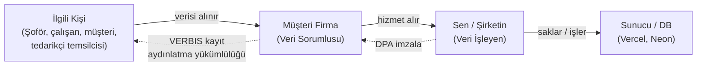
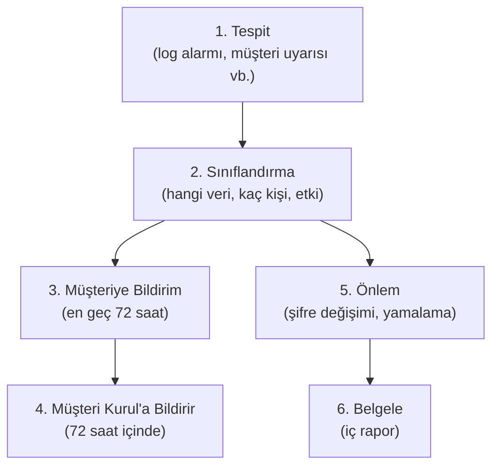

# Şirket Kurulumu ve KVKK Uyum Rehberi

> **SaaS satıcısı olarak nasıl yola çıkılır, hangi şirketi açarsın, KVKK seni nasıl bağlar, müşteriyle hangi sözleşmeleri imzalarsın — uçtan uca pratik rehber.**

*Son güncelleme: Mayıs 2026*

---

## ⚠️ ÖNEMLİ DİSCLAİMER (Önce Bunu Oku)

Bu doküman **avukat tavsiyesi değildir**. Aşağıdaki tüm bilgiler ve şablonlar:

1. **Genel rehber niteliğindedir.** Senin somut durumunda farklılıklar olabilir.
2. **Şablonlar başlangıç noktasıdır.** İlk müşteri sözleşmesi imzalanmadan önce mutlaka **bir avukata** (tercihen bilişim/sözleşme hukuku uzmanı) gözden geçirtmelisin. Tek seferlik danışma ücreti ortalama 5.000–15.000 TL arasındadır ve **kendini cezadan koruyacak en iyi yatırım**dır.
3. **KVKK madde referansları** 6698 sayılı Kişisel Verilerin Korunması Kanunu'na göredir. Mevzuat değişebilir; sözleşme imzalamadan önce **mevcut KVKK Kurulu rehberlerini** kontrol et: [kvkk.gov.tr](https://www.kvkk.gov.tr).
4. **Vergi rakamları** 2026 yılı için tahminî değerlerdir. Her yıl yeniden değerleme oranı ile güncellenir; mali müşavirin sana güncel rakamı verir.
5. **KVKK ihlal cezaları** 2026 itibarıyla 60.000 TL'den başlar, en yüksek 12.000.000+ TL'dir (yeniden değerleme ile artar). Yani bu konu hafife alınmaz.

> **Yapman gereken:** Bu MD'yi okuduktan sonra mali müşavir + avukat ikilisine git. Bu MD onlara verirsin, "şu yapıdayım" dersin, oradan ilerlersin.

---

## İçindekiler

**Bölüm A — Şirket Kurulumu**

1. [Şirket Türü Seçimi (29 Yaş Altı Senaryosu)](#1-şirket-türü-seçimi-29-yaş-altı-senaryosu)
2. [Genç Girişimci Kazanç İstisnası — En Önemli Avantajın](#2-genç-girişimci-kazanç-i̇stisnası--en-önemli-avantajın)
3. [Şahıs Şirketi Kuruluş Adımları (Pratik)](#3-şahıs-şirketi-kuruluş-adımları-pratik)
4. [İlk 3 Yıl Vergi & Sigorta Tablosu](#4-i̇lk-3-yıl-vergi--sigorta-tablosu)

**Bölüm B — KVKK Uyumu**

5. [KVKK Rolleri ve Senin Konumun](#5-kvkk-rolleri-ve-senin-konumun)
6. [Veri İşleyen Olarak Yükümlülüklerin](#6-veri-i̇şleyen-olarak-yükümlülüklerin)
7. [VERBIS Kayıt Durumu](#7-verbis-kayıt-durumu)
8. [Yurtdışı Veri Aktarımı (Vercel + Neon Durumu)](#8-yurtdışı-veri-aktarımı-vercel--neon-durumu)
9. [Veri İhlali Olduğunda Ne Yaparsın](#9-veri-i̇hlali-olduğunda-ne-yaparsın)

**Bölüm C — Şablon Metinler**

10. [Şablon 1 — Aydınlatma Metni (Web Siten İçin)](#şablon-1--aydınlatma-metni-web-siten-i̇çin)
11. [Şablon 2 — Açık Rıza Metni](#şablon-2--açık-rıza-metni)
12. [Şablon 3 — Çerez Politikası](#şablon-3--çerez-politikası)
13. [Şablon 4 — Müşteri Hizmet Sözleşmesi](#şablon-4--müşteri-hizmet-sözleşmesi)
14. [Şablon 5 — NDA (Karşılıklı Gizlilik Sözleşmesi)](#şablon-5--nda-karşılıklı-gizlilik-sözleşmesi)
15. [Şablon 6 — Veri İşleme Sözleşmesi (DPA)](#şablon-6--veri-i̇şleme-sözleşmesi-dpa)
16. [Şablon 7 — Veri İhlali Bildirim Prosedürü (İç Doküman)](#şablon-7--veri-i̇hlali-bildirim-prosedürü-i̇ç-doküman)

**Bölüm D — Yol Haritası ve Avukat Soruları**

17. [Sıralı Yapılacaklar Listesi](#17-sıralı-yapılacaklar-listesi)
18. [Avukatına Soracağın Sorular](#18-avukatına-soracağın-sorular)

---

# BÖLÜM A — ŞİRKET KURULUMU

## 1. Şirket Türü Seçimi (29 Yaş Altı Senaryosu)

Türkiye'de SaaS işi yapacak biri için 3 ana seçenek var. Karşılaştırma:

| Kriter | Şahıs Şirketi | Limited Şirket (Ltd.) | Anonim Şirket (A.Ş.) |
|--------|---------------|------------------------|----------------------|
| **Asgari sermaye** | Yok | 50.000 TL | 250.000 TL |
| **Kuruluş süresi** | 1–2 gün | 3–5 iş günü | 1–2 hafta |
| **Aylık muhasebe maliyeti** | ~2.000–3.000 TL | ~3.500–5.500 TL | ~5.500–8.000 TL |
| **Kuruluş maliyeti** | ~1.000–2.500 TL | ~6.000–10.000 TL | ~12.000–20.000 TL |
| **Vergi yapısı** | Gelir vergisi (%15–%40 dilimli) | Kurumlar vergisi %25 + kâr dağıtım stopajı %10 | Aynı Ltd. |
| **Sorumluluk** | **Sınırsız** (kişisel mal varlığın dahil) | Sermaye ile sınırlı | Sermaye ile sınırlı |
| **Pay devri** | Mümkün değil | Noter onaylı + ortaklar onayı | Hisse senediyle kolay |
| **Yatırım çekme** | Zor | Orta | Kolay (en uygun) |
| **Genç Girişimci muafiyeti** | **VAR (~330K TL/yıl × 3 yıl)** | YOK | YOK |
| **BAĞKUR muafiyeti (1 yıl)** | **VAR** | YOK | YOK |

### Net Öneri (Senin Durumun İçin)

**İlk 3 yıl: Şahıs Şirketi + Genç Girişimci + BAĞKUR muafiyeti.**

Neden?

1. **Sıfıra yakın vergi:** İlk 3 yıl yıllık ~330K TL'ye kadar gelir vergisi yok (sadece KDV ödüyorsun, o da müşteriden tahsil ettiğin).
2. **Ucuz işletim:** Aylık ~2.000–3.000 TL muhasebe yetiyor.
3. **Hızlı kuruluş:** 1–2 günde başlarsın.
4. **Tek dezavantaj — sınırsız sorumluluk:** İşin bozulup borç çıkarsa kişisel mal varlığına gidiliyor. Ama:
   - SaaS işinde stok riski yok
   - Müşteri sözleşmesinde "sorumluluk sınırlaması" maddesi koyduğunda büyük ölçüde kapatılır
   - 3 yıl sonra Limited'e geçince zaten sınırlı sorumluluğa kavuşursun

### Ne Zaman Limited'e Geçersin?

Aşağıdakilerden **biri** gerçekleştiğinde:

- Yıllık cironun **1.000.000 TL'yi geçtiği yıl** (Genç Girişimci muafiyetinin sınırını aşacaksın, vergi avantajı erimeye başlar)
- Genç Girişimci muafiyetinin **3 yılı dolduğu**
- Yatırımcı/ortak almak istediğin (şahısta hisse devri yok)
- Müşterilerin "Limited olun" diye baskı yaptığı (bazı kurumsal müşteri politikası bu)

Geçiş kolay: aynı ticaret unvanını taşıyabilirsin, faaliyet kodu aynı, sadece şirket türü değişir. Mali müşavirin halleder.

---

## 2. Genç Girişimci Kazanç İstisnası — En Önemli Avantajın

**Yasal dayanak:** Gelir Vergisi Kanunu Mükerrer Madde 20.

### Şartlar

Aşağıdaki **tüm** koşulları karşılaman lazım:

1. **Yaş:** İşe başlama tarihinde **29 yaşını doldurmamış** olmak (yani 30. yaş gününe kadar başvurabiliyorsun).
2. **İlk defa mükellefiyet:** Daha önce hiçbir şirketin (şahıs/limited/A.Ş.) ortağı veya sahibi olmamak.
3. **Gerçek kişi:** Sadece **şahıs şirketi** olarak çalışıyor olmak (Ltd./A.Ş. değil).
4. **Kendi işin:** Çalışan olarak değil, kendi adına faaliyet göstermek.
5. **Faaliyet süresi:** İşe başladıktan sonra **kesintisiz** çalışma (kısa süreli kapatıp tekrar açma muafiyeti bozar).

### Avantajlar

| Kalem | Detay |
|-------|-------|
| **Gelir vergisi muafiyeti** | Yıllık **~330.000 TL'ye** kadar (2026 endeks değer; her yıl güncellenir) gelirin %100 vergiden muaf |
| **Süre** | İşe başlama tarihinden itibaren **3 takvim yılı** |
| **BAĞKUR (4/B) primi** | İlk 1 yıl Hazine destekli — normalde ~6.000 TL/ay olan primin yarısını ödüyorsun |
| **KDV** | Muaf değilsin — KDV mükellefi olarak normal süreç (ama KDV zaten müşteriden tahsil ettiğin) |
| **Stopaj** | Bazı durumlarda muaf, mali müşavirin söyler |

### Pratik Örnek (Senin İçin)

Diyelim ki ilk yıl 5 müşteriye toplam 200.000 TL kurulum + 60.000 TL aylık abonelik = **260.000 TL** gelirin oldu.

| Kalem | Şahıs + Genç Girişimci | Limited Şirket |
|-------|------------------------|----------------|
| Gelir | 260.000 TL | 260.000 TL |
| **Gelir/Kurumlar vergisi** | **0 TL** (muaf) | ~65.000 TL (%25) |
| KDV (zaten tahsil edilen) | Devlete iade | Devlete iade |
| Muhasebe | ~30.000 TL/yıl | ~60.000 TL/yıl |
| Net | **~230.000 TL** | ~135.000 TL |

**Fark: ~95.000 TL/yıl, üç yılda ~285.000 TL.** Bu, ilk müşterilerinden kar etmenin neredeyse tamamı.

### Önemli Tuzaklar

- **Eşinden veya birinci dereceden yakınından devralmak muafiyeti bozar.** (Babanın işini devralırsan olmuyor.)
- **Ortak olmak muafiyeti bozar.** Şahıs şirketinde tek başına olmalısın.
- **3 yıl bittiğinde otomatik geçiş yok**, sen yeni mükellefiyet açıyorsun (Limited vs.). Mali müşavirin dönemini takip eder.

---

## 3. Şahıs Şirketi Kuruluş Adımları (Pratik)

Sırayla yapacakların:

### Adım 1 — Mali Müşavir Bul (1–2 gün)

- Bölgendeki SMMM (Serbest Muhasebeci Mali Müşavir) bul.
- **Aylık ücret:** Bilişim/yazılım iş kolu için ortalama 2.000–3.000 TL/ay.
- Sor: "Genç Girişimci muafiyetinden yararlanacağım, başvuru sürecini biliyor musunuz?" Bilen birini seç.
- Sözleşme imzala, vekaletname ver — kuruluşu o halleder.

### Adım 2 — Vergi Dairesi Mükellefiyeti (1 gün)

Mali müşavirin yapar, ama bilmen gerekenler:

- **Faaliyet kodu (NACE):** **62.01.01** — "Bilgisayar programlama faaliyetleri (yazılım yapımı, sistem analizi vb.)"
- **Ek kodlar (opsiyonel):** 62.02.01 (bilgisayar danışmanlığı), 63.11.01 (veri işleme, hosting)
- **Mükellefiyet türü:** Gerçek usulde gelir vergisi
- **KDV mükellefiyeti:** Otomatik açılır
- **Yoklama:** Vergi dairesi memuru iş yerine gelip "burada gerçekten çalışılıyor mu" diye bakar (ev ofisi de olur, sözleşmesi yetiyor).

### Adım 3 — Genç Girişimci Beyanı (Aynı Gün)

- Mükellefiyet açılırken aynı anda **"Genç Girişimci Kazanç İstisnası Talep Dilekçesi"** veriyorsun.
- Mali müşavirin formu hazırlar, sen imzalarsın.
- 1–2 hafta içinde onay/red gelir (genelde sorunsuz).

### Adım 4 — İş Yeri Bildirimi

- **Ev ofisi:** Yapılabiliyor, sözleşmen şart. Kira sözleşmen ev ofisi olduğunu belirtmeli (yoksa ev sahibinden onay).
- **Ortak ofis (co-working):** Sözleşmesi yetiyor.
- **Kendi ofisin:** Tapu/kira sözleşmesi yeterli.

### Adım 5 — Banka Hesabı (1 gün)

- **Ticari hesap** (kişisel hesap olmaz, vergi dairesi sıkıntı çıkarır).
- **POS / sanal POS:** Müşteri kart ile ödeme yapacaksa lazım. Iyzico, Stripe (yurtdışı), Param, PayTR seçenekleri var.
- **Aylık masraflar:** Ticari hesap aylık ~150–500 TL (banka değişir).

### Adım 6 — E-Fatura/E-Arşiv (Opsiyonel, Başlangıçta)

- Cironun **3 milyon TL'yi geçtiği yıl** zorunlu hale gelir.
- Önce zorunlu olmayanlar **e-arşiv fatura** kullanabilir (mali müşavir kayıt yapar).
- Maliyet: GİB üzerinden ücretsiz veya entegratör (Logo, Mikro vb.) üzerinden ~250–500 TL/ay.

### Adım 7 — BAĞKUR Kaydı (Otomatik)

- Mükellefiyet açıldığında SGK BAĞKUR (4/B) sigortası otomatik başlar.
- **Aylık prim:** ~6.000 TL (asgari ücret üzerinden, 2026 tahmini).
- **Genç Girişimci olarak ilk 1 yıl Hazine desteği:** Yarısı (~3.000 TL/ay) Hazine ödüyor.

### Adım 8 — Web Sitesi / Aydınlatma Metni

- Web siten varsa **KVKK Aydınlatma Metni + Çerez Politikası** koyman ZORUNLU (ileride Şablon 1 ve 3'te).
- İletişim formu varsa ek olarak **Açık Rıza** kutusu (Şablon 2).

### Toplam Maliyet Tahmini (İlk 6 Ay)

| Kalem | Tutar |
|-------|-------|
| Şirket kuruluş (mali müşavir + harçlar) | ~1.500 TL |
| Mali müşavir (6 ay) | ~15.000 TL |
| BAĞKUR (Hazine desteği sonrası, 6 ay) | ~18.000 TL |
| Banka ticari hesap (6 ay) | ~1.500 TL |
| E-arşiv entegratör (opsiyonel, 6 ay) | ~2.000 TL |
| **Avukat danışmanlığı (1 sefer, kritik)** | **~5.000–10.000 TL** |
| **Toplam** | **~43.000–48.000 TL** |

---

## 4. İlk 3 Yıl Vergi & Sigorta Tablosu

Senaryo: Yıllık gelir 260.000 TL (5 müşteri ortalama).

| | **Yıl 1** | **Yıl 2** | **Yıl 3** | **Yıl 4 (Geçiş)** |
|---|-----------|-----------|-----------|-------------------|
| Brüt gelir | 260.000 | 350.000 | 500.000 | 700.000 |
| **Gelir vergisi** | **0** (muafiyet) | **0** (muafiyet) | **0** (muafiyet) | ~120.000 (artan oran) |
| KDV (devlete iade) | 52.000 (zaten müşteriden) | 70.000 | 100.000 | 140.000 |
| BAĞKUR | ~36.000 (yarısı Hazine) | ~72.000 | ~80.000 | ~88.000 |
| Mali müşavir | ~30.000 | ~33.000 | ~36.000 | ~60.000 (Limited) |
| **Net cebine kalan** | **~194.000** | **~245.000** | **~384.000** | **~432.000** |

> **3. yıl sonunda ciroyu büyütüp Limited'e geçeceksin.** Ya da Genç Girişimci muafiyeti bittiği için Limited daha avantajlı hale gelir.

---

# BÖLÜM B — KVKK UYUMU

## 5. KVKK Rolleri ve Senin Konumun

KVKK üç temel aktör tanımlıyor:



### Üç Temel Rol

| Rol | Kim? | Sorumluluk |
|-----|------|------------|
| **İlgili Kişi** (Veri Öznesi) | Müşteri firmanın çalışanları, şoförler, tedarikçi temsilcileri, vs. | Hakları var (md. 11) |
| **Veri Sorumlusu** (Data Controller) | **Müşteri firma** | Verileri işleme amacını/yöntemini belirleyen. VERBIS, aydınlatma, açık rıza onun sorumluluğu |
| **Veri İşleyen** (Data Processor) | **Sen / SaaS şirketin** | Müşterinin **adına ve talimatıyla** veriyi barındıran/işleyen |

### Bu Ne Demek? (Pratikte)

- **Müşterin** çalışanlarını ve şoförlerini sisteme ekliyor — onların kişisel verisinin **sorumlusu o**. VERBIS kaydı, aydınlatma metni, açık rıza alma onun işi.
- **Sen** sadece o veriyi sunucusunda barındırıyor ve yazılımı sağlıyorsun. Sen "veri işleyen" rolündesin.
- **AMA:** Senin de yükümlülüklerin var — teknik tedbirler almak, ihlal halinde bildirmek, DPA imzalamak.

> Önemli: Sen müşterinin yerine geçemezsin. Müşteri kendi VERBIS kaydını yapmak zorunda. Sen sadece kendi yükümlülüklerinden sorumlusun.

---

## 6. Veri İşleyen Olarak Yükümlülüklerin

KVKK md. 12 uyarınca **Veri İşleyen** olarak yapman gerekenler:

### 6.1. Teknik Tedbirler

| Tedbir | Senin Durumun | Eksik mi? |
|--------|---------------|-----------|
| Şifreleme (saklamada) | Vercel Blob şifreli, Postgres TLS, fiyatlar uygulama-içi şifreli (planlı) | Fiyat şifrelemesi henüz kodda yok |
| Şifreleme (iletimde) | HTTPS (Let's Encrypt SSL) | Tamam |
| Erişim kontrolü | NextAuth + RBAC (admin/manager/user/supplier) | Tamam |
| Erişim logu | Mevcut değil | **Eklenmesi önerilir** (kim ne zaman ne yaptı) |
| Yedekleme | Neon otomatik yedek (7 gün) + Vercel Blob versiyonlama | Tamam, ama günlük dış yedek de eklenebilir |
| Güvenlik güncellemeleri | npm audit, dependabot | **Süreç tanımlanmalı** (aylık güncelleme) |
| Rate limiting | Upstash Redis ile mevcut | Tamam |
| Brute-force koruması | NextAuth + rate limit | Tamam |

### 6.2. İdari Tedbirler

- **Çalışan eğitimi:** Tek kişiysen kendine bir "iç eğitim notu" yaz, dosyaya koy. KVKK Kurulu denetiminde göstereceksin.
- **NDA:** İleride alt yüklenici/freelancer tutarsan onlarla NDA imzala (Şablon 5).
- **Veri saklama ve imha politikası:** 1 sayfalık iç doküman, "müşteri sözleşmesi sona erince 30 gün içinde silinir" gibi süreleri yaz.

### 6.3. Müşteriyle DPA İmzala (Zorunlu)

KVKK md. 12/3: "Veri sorumlusu adına başka bir gerçek veya tüzel kişi tarafından kişisel veri işlenmesi hâlinde, ... bunlar arasında **yazılı bir sözleşme** yapılması zorunludur."

Bu sözleşme **Veri İşleme Sözleşmesi (DPA)**. Şablon 6'da hazır.

### 6.4. Yurtdışı Aktarım (Vercel/Neon Kullanıyorsan)

- Vercel ve Neon yurtdışı server kullanıyor.
- KVKK md. 9: Yurtdışı aktarım için **müşterinin açık rızası** gerekir, **veya** ülke "yeterli korumalı" olmalı.
- Türkiye'nin yeterli korumalı ülke listesi şu an çok sınırlı (2026 itibarıyla AB/Singapur sınırlı durumlar).
- **Pratik çözüm:** Müşteri sözleşmesinde **açık rıza maddesi** koy + AB region (Frankfurt) seç + şifreli sakla.

### 6.5. İhlal Bildirimi

KVKK md. 12/5: "İşlenen kişisel verilerin kanuni olmayan yollarla başkaları tarafından elde edilmesi hâlinde, **veri sorumlusu** bu durumu en kısa sürede ilgilisine ve Kurula bildirir."

- **Sen veri işleyensin**, doğrudan Kurul'a bildirme yükümlülüğün yok.
- Ama **müşteriye bildirmek zorundasın**, **en geç 72 saat** içinde (KVKK Kurulu kararı 2019/271).
- Müşteri Kurul'a bildirir, sen ona detayları sağlarsın.
- **Süreç:** Şablon 7'de tanımlı.

### 6.6. Veri Saklama ve İmha

Müşteri sözleşmesi bittiğinde:

- **30 gün içinde** tüm veriyi sil (DPA'da yazılı süreye uy).
- **Yazılı tutanak** ile müşteriye bildir ("şu tarihte tüm veri silindi, şu yedekler de imha edildi").
- Eğer müşteri "veriyi bana ver" derse, **şifreli yedek** olarak teslim et, sonra sil.

---

## 7. VERBIS Kayıt Durumu

VERBIS = **Veri Sorumluları Sicili Bilgi Sistemi**. KVKK Kurulu'nun tuttuğu kayıt.

### Senin VERBIS Yükümlülüğün

KVKK Kurulu Genelgesi 2018/1 ve sonraki güncellemelere göre **muafiyet** kriterleri:

- Yıllık çalışan sayısı **50'den az**, VE
- Yıllık mali bilanço **25 milyon TL'den az**, VE
- **Özel nitelikli kişisel veri** işlemiyor (sağlık, biyometrik, ceza mahkûmiyeti vb.)

**Senin durumun:**

- Çalışan: 0–1 (kendin)
- Bilanço: 25M altında
- Özel veri: İşlemiyorsun (evrak PDF'leri kişisel ama "özel nitelikli" değil)

→ **VERBIS kaydından muafsın.**

### Müşterinin VERBIS Durumu (Önemli!)

Müşterinin firmanın yıllık çalışan sayısı 50'yi geçiyorsa veya bilanço 25M'i aşıyorsa **müşteri VERBIS kaydı yapmak zorunda**. Bu senin değil onun yükümlülüğü, ama:

- Sözleşmede **"müşteri kendi VERBIS yükümlülüklerinden sorumludur"** maddesi koy (Şablon 4'te var).
- Müşterin VERBIS'te seni "veri işleyen" olarak listelemek zorunda — bilgilerini ona ver.

---

## 8. Yurtdışı Veri Aktarımı (Vercel + Neon Durumu)

KVKK md. 9 yurtdışı aktarımı sıkı tutar. Üç koşuldan biri olmalı:

1. **İlgili kişinin açık rızası** (zor, herkesin onayını alamazsın)
2. Hedef ülkenin **yeterli korumalı** olması (Türkiye için kısa liste)
3. **Aktarım gerekçeleri** (sözleşmenin ifası, hukuki yükümlülük, vb.) + **taahhütname**

### Senin Stack'in için Çözüm

| Servis | Yer | Çözüm |
|--------|-----|-------|
| **Vercel (hosting)** | Region seçilebilir | **Frankfurt (fra1)** seç |
| **Neon (DB)** | Region seçilebilir | **EU (Frankfurt)** seç |
| **Vercel Blob** | Otomatik AB | Tamam |
| **Upstash Redis** | Region seçilebilir | **EU (Frankfurt)** seç |
| **Resend (e-posta)** | ABD merkezli | Sözleşmede açık rıza maddesi |

### Pratik Adımlar

1. **Yeni proje açarken AB region seç.** Mevcut Vercel/Neon kayıtlarını AB region'a migrate et.
2. **Müşteri Sözleşmesinde Madde:** "Müşteri, hizmetin sağlanması için verilerin Avrupa Birliği üye ülkelerindeki sunucularda işlenebileceğini ve saklanabileceğini kabul eder." (Şablon 4'te var.)
3. **Aydınlatma Metninde Açıklama:** Web sitende ve müşteri panelinde, hangi servisi kullandığını ve nerede tutulduğunu belirt (Şablon 1).
4. **Açık Rıza Kutusu:** Kayıt formunda "yurtdışı aktarımı kabul ediyorum" çek kutusu (Şablon 2).

---

## 9. Veri İhlali Olduğunda Ne Yaparsın

İhlal = "kişisel verilerin yetkisiz kişiler tarafından elde edilmesi" (sızma, hack, çalan ekip, yanlışlıkla maile yollama vb.).

### Akış (Şablon 7'de detayı var)



### Süre — 72 Saat Kuralı

- **Sen → Müşteri:** İhlali öğrendiğin andan **72 saat**.
- **Müşteri → KVKK Kurulu:** Müşterinin öğrendiği andan **72 saat** (KVKK Kurul kararı 2019/271).

Yani sen geç bildirirsen müşteri zora düşer, sözleşme ihlal eder, sana yansıtır. **Hızlı bildirim = sorunun kendisinden daha az hasar.**

---

# BÖLÜM C — ŞABLON METİNLER

> **UYARI:** Aşağıdaki tüm şablonlar **başlangıç noktasıdır**. Avukat onayı olmadan kullanma. Köşeli parantez `[...]` içindeki yerler senin doldurman gereken alanlar.

---

## Şablon 1 — Aydınlatma Metni (Web Siten İçin)

> Web sitende footer'a "KVKK Aydınlatma Metni" linki olarak konur. İletişim formu doldurulurken kullanıcıya gösterilir.

```markdown
# KVKK Aydınlatma Metni

[ŞİRKET ADI] (bundan sonra "Şirket" olarak anılacaktır) olarak, 6698 sayılı
Kişisel Verilerin Korunması Kanunu ("KVKK") uyarınca veri sorumlusu sıfatıyla,
işbu Aydınlatma Metni ile sizleri kişisel verilerinizin işlenmesi konusunda
bilgilendirmek isteriz.

## 1. Veri Sorumlusu

**Veri Sorumlusu:** [ŞİRKET ADI]
**Adres:** [ADRES]
**Vergi Dairesi/No:** [VD] / [VKN]
**MERSİS No:** [MERSIS]
**E-posta:** [kvkk@example.com]
**Telefon:** [TELEFON]

## 2. İşlenen Kişisel Veri Kategorileri

Web sitemizi kullandığınızda veya bizimle iletişime geçtiğinizde aşağıdaki
kişisel verileriniz işlenmektedir:

- **Kimlik Bilgileri:** Ad, soyad, unvan
- **İletişim Bilgileri:** E-posta adresi, telefon numarası, adres
- **İşlem Bilgileri:** IP adresi, tarayıcı bilgisi, ziyaret tarih/saati,
  ziyaret edilen sayfalar, çerez verileri
- **Müşteri İşlem Bilgileri:** Demo talep formu yanıtları, teklif talepleri,
  satın alma kayıtları
- **Pazarlama Bilgileri:** Bültene abone olma tercihleri (varsa)

## 3. Kişisel Verilerin İşlenme Amaçları

Kişisel verileriniz aşağıdaki amaçlarla işlenmektedir:

a) Web sitesi üzerinden iletişim taleplerinin değerlendirilmesi ve
   yanıtlanması
b) Sözleşme öncesi tekliflerin hazırlanması
c) Müşteri ilişkileri yönetimi ve müşteri memnuniyeti süreçlerinin yürütülmesi
d) Hizmetlerin iyileştirilmesi ve geliştirilmesi
e) Yasal yükümlülüklerin yerine getirilmesi
f) Web sitesinin güvenliğinin sağlanması
g) İstatistiksel analiz ve raporlama

## 4. Kişisel Verilerin Toplanma Yöntemi ve Hukuki Sebebi

Kişisel verileriniz; web sitemizdeki formlar, çerezler, e-posta ve telefon
iletişimi yoluyla otomatik veya kısmen otomatik yöntemlerle toplanmaktadır.

İşlemenin hukuki sebepleri (KVKK md. 5):
- Sözleşmenin kurulması veya ifası için gerekli olması
- Şirketin meşru menfaatlerinin gerektirmesi
- Açık rıza (pazarlama amaçlı işlemler için)

## 5. Kişisel Verilerin Aktarılması

Kişisel verileriniz, aşağıdaki taraflara aktarılabilir:

a) **Hizmet Sağlayıcılar:** Hizmetin sürdürülebilmesi için işbirliği yaptığımız
   teknoloji sağlayıcıları (web hosting, e-posta, analitik), sınırlı erişim
   ile.
b) **Yetkili Kamu Kurumları:** Yasal yükümlülükler kapsamında.
c) **Yurtdışı:** Hizmetin sağlanması için Vercel Inc. (ABD/AB), Neon Inc.
   (ABD/AB), Resend Inc. (ABD) gibi sağlayıcılarla çalışmaktayız. Yurtdışı
   aktarım, KVKK md. 9 uyarınca açık rızanıza dayanmaktadır (formda ayrıca
   onaylayacaksınız) ve veriler şifreli olarak aktarılır.

## 6. Saklama Süresi

Kişisel verileriniz, işleme amacının gerektirdiği süre boyunca veya yasal
saklama süresince muhafaza edilir:

- İletişim formu yanıtları: 2 yıl
- Müşteri sözleşme verileri: Sözleşme süresi + 10 yıl (TBK genel zamanaşımı)
- Pazarlama izinli e-posta listesi: İzin geri alınana kadar
- Web sitesi log/çerez verileri: 6 ay

Süre bitiminde kişisel veriler silinir, yok edilir veya anonim hale getirilir.

## 7. KVKK Madde 11 Kapsamındaki Haklarınız

Veri sorumlusu sıfatıyla şirketimize başvurarak KVKK madde 11 uyarınca
aşağıdaki haklarınızı kullanabilirsiniz:

a) Kişisel verilerinizin işlenip işlenmediğini öğrenme
b) İşlendiyse buna ilişkin bilgi talep etme
c) İşlenme amacını ve bunların amacına uygun kullanılıp kullanılmadığını
   öğrenme
ç) Yurt içinde veya yurt dışında aktarıldığı üçüncü kişileri bilme
d) Eksik veya yanlış işlenmiş olması hâlinde bunların düzeltilmesini isteme
e) Silinmesini veya yok edilmesini isteme
f) (d) ve (e) bentleri uyarınca yapılan işlemlerin, aktarıldığı üçüncü
   kişilere bildirilmesini isteme
g) Münhasıran otomatik sistemler vasıtasıyla analiz edilmesi suretiyle
   aleyhinize bir sonucun ortaya çıkmasına itiraz etme
ğ) Kanuna aykırı işlenmesi sebebiyle zarara uğramanız hâlinde zararın
   giderilmesini talep etme

## 8. Başvuru Yöntemi

Yukarıdaki haklarınızı kullanmak için, kimliğinizi tevsik edici belgeler
ve talebi içeren yazılı dilekçe ile aşağıdaki adresten başvurabilirsiniz:

- **E-posta:** [kvkk@example.com] (kimliği tevsik edici belge ekiyle)
- **Posta:** [ADRES]
- **KEP:** [KEP ADRESİ varsa]

Başvurunuz en geç 30 gün içinde sonuçlandırılır.

---

*Yürürlük tarihi: [TARİH]*
*Son güncelleme: [TARİH]*
```

---

## Şablon 2 — Açık Rıza Metni

> Web sitesi formlarında ve müşteri kayıt akışında ayrı ayrı işaretlenecek **iki ayrı kutu**. Tek kutuya birden fazla rıza koyma — geçersiz olur.

### A) Pazarlama / Bülten İzni (Opsiyonel)

```markdown
☐ Şirketinizin ürün/hizmet tanıtımı, kampanya ve fırsat bilgilerini
   içeren ticari elektronik iletilerin (e-posta, SMS) tarafıma gönderilmesine
   açık rıza veriyorum.

   Bu rızamı istediğim zaman geri alabileceğimi (e-postanın sonundaki "üyelikten
   ayrıl" linki veya kvkk@example.com adresine bildirim ile) anlamış bulunuyorum.
```

### B) Yurtdışı Aktarım Açık Rızası (Müşteri Sözleşmesi İçin)

```markdown
☐ Hizmetin sağlanması için, KVKK madde 9 kapsamında, kişisel verilerimin
   ve şirketim adına işlenen kişisel verilerin aşağıdaki ülkelerdeki sunuculara
   aktarılmasına ve bu sunucularda saklanmasına açık rıza veriyorum:

   - Avrupa Birliği üye ülkeleri (Vercel Inc. — Frankfurt, Almanya)
   - Avrupa Birliği üye ülkeleri (Neon Inc. — Frankfurt, Almanya)
   - Amerika Birleşik Devletleri (Resend Inc. — e-posta sunucuları)

   Verilerin şifreli olarak aktarıldığını ve hizmet sağlayıcılarının kendi
   gizlilik politikaları ile korunduğunu kabul ediyorum.
```

---

## Şablon 3 — Çerez Politikası

> Web sitende `/cerez-politikasi` sayfasında yayınlanır. Site açılışında bir cookie banner göster, kullanıcı kabul/red yapsın.

```markdown
# Çerez (Cookie) Politikası

## 1. Çerez Nedir?

Çerezler, web siteleri tarafından tarayıcınızda saklanan küçük metin
dosyalarıdır. Sitemizin daha verimli çalışması ve kullanıcı deneyiminin
iyileştirilmesi için kullanılır.

## 2. Kullandığımız Çerez Türleri

### a) Zorunlu Çerezler (Onay Gerektirmez)

Web sitesinin temel işlevleri için gereklidir.

| Çerez | Amaç | Süre |
|-------|------|------|
| `next-auth.session-token` | Oturum yönetimi | Oturum süresi |
| `next-auth.csrf-token` | Güvenlik (CSRF koruması) | 1 saat |
| `cookie-consent` | Çerez onay tercihinizi hatırlamak | 1 yıl |

### b) Performans / Analitik Çerezleri (Onay Gerekir)

Site kullanımının analiz edilmesi için kullanılır.

| Çerez | Sağlayıcı | Amaç | Süre |
|-------|-----------|------|------|
| `_ga`, `_gid` | Google Analytics | Ziyaretçi sayısı, davranış analizi | 2 yıl / 24 saat |
| `_vercel_*` | Vercel | Sayfa yüklenme metrikleri | 7 gün |

### c) Pazarlama Çerezleri (Onay Gerekir)

(Henüz kullanılmıyorsa bu bölümü çıkar.)

| Çerez | Sağlayıcı | Amaç | Süre |
|-------|-----------|------|------|

## 3. Çerez Onayını Geri Alma

İstediğiniz zaman:
- Tarayıcı ayarlarından çerezleri silebilirsiniz
- Sitemizdeki "Çerez Tercihleri" sayfasından onayınızı geri çekebilirsiniz

## 4. İlgili Kişi Hakları

KVKK Aydınlatma Metni'nde belirtilen tüm haklarınız çerez verileri için
de geçerlidir.

---

*Son güncelleme: [TARİH]*
```

---

## Şablon 4 — Müşteri Hizmet Sözleşmesi

> Her yeni müşteriyle imzalayacağın ana sözleşme. Avukat ZORUNLU gözden geçirsin.

```markdown
# YAZILIM HİZMETİ KİRA VE LİSANS SÖZLEŞMESİ

## TARAFLAR

**HİZMET SAĞLAYICI:**
[ŞİRKET ADI]
Adres: [ADRES]
Vergi Dairesi: [VD] - VKN: [VKN]
E-posta: [E-POSTA]
Telefon: [TELEFON]
(Bundan sonra "Sağlayıcı" olarak anılacaktır.)

**MÜŞTERİ:**
[MÜŞTERİ ŞİRKET ADI]
Adres: [ADRES]
Vergi Dairesi: [VD] - VKN: [VKN]
Yetkili: [AD SOYAD] - [UNVAN]
E-posta: [E-POSTA]
Telefon: [TELEFON]
(Bundan sonra "Müşteri" olarak anılacaktır.)

## MADDE 1 — KONU

İşbu sözleşmenin konusu, Sağlayıcı'nın geliştirdiği "Uzhan ERP" adlı
yazılımın (bundan sonra "Yazılım"), Müşteri'nin servis filosu yönetimi
amacıyla bulut tabanlı (SaaS) olarak kullanımına sunulması ve buna ilişkin
hizmetlerin sağlanmasıdır.

## MADDE 2 — HİZMET KAPSAMI

Sağlayıcı, [PAKET ADI] paketi dahilinde aşağıdaki hizmetleri sunar:

a) Yazılımın bulut sunucusunda kurulumu ve sürdürülmesi
b) Müşteri'ye özel alan adı (subdomain veya custom domain) tanımlanması
c) SSL sertifikası temini
d) Otomatik günlük yedekleme (30 gün geriye dönük)
e) Aylık güvenlik ve sürüm güncellemeleri
f) Belirtilen iletişim kanalları üzerinden teknik destek
g) [PAKET DETAYLARI — Başlangıç/Standart/Premium]

## MADDE 3 — BEDEL VE ÖDEME

3.1. **Kurulum bedeli:** [TUTAR] TL + KDV — sözleşme imza tarihinde peşin
     olarak ödenir.

3.2. **Aylık hizmet bedeli:** [TUTAR] TL + KDV — her ayın ilk 5 (beş) iş
     günü içinde Sağlayıcı'nın belirttiği banka hesabına yatırılır.

3.3. **Fiyat artışı:** Sağlayıcı yıllık ÜFE oranında veya en az asgari
     ücret artış oranında fiyat artışı yapma hakkını saklı tutar. Artış
     en az 30 (otuz) gün önceden Müşteri'ye yazılı bildirilir.

3.4. **Geç ödeme:** Aylık bedelin 15 (on beş) günden fazla gecikmesi halinde
     Sağlayıcı, hizmeti askıya alma ve faiz talep etme hakkına sahiptir.

3.5. **KDV:** Tüm bedellere KDV ayrıca eklenir.

## MADDE 4 — SÜRE VE FESİH

4.1. **Süre:** İşbu sözleşme, imza tarihinden itibaren süresizdir.

4.2. **Fesih:** Her iki taraf da, **30 (otuz) gün önceden yazılı bildirimde**
     bulunarak sözleşmeyi feshedebilir. Yazılı bildirim e-posta veya KEP
     yoluyla yapılabilir.

4.3. **Haklı fesih:** Aşağıdaki durumlarda taraflar süre vermeksizin
     sözleşmeyi feshedebilir:
     - Bedellerin 30 günden fazla gecikmesi
     - Sözleşme ihlali (15 gün ihtarname sonrası)
     - İflas, konkordato, tasfiye

4.4. **Veri teslimi:** Sözleşme sonlandığında Sağlayıcı, Müşteri'nin
     tüm verisini şifreli yedek olarak Müşteri'ye teslim eder ve sözleşme
     sona erme tarihinden itibaren **30 gün içinde** tüm veriyi sunucudan
     siler. Silme işlemi yazılı tutanakla belgelenir.

## MADDE 5 — FİKRİ VE SINAİ MÜLKİYET

5.1. **Yazılım üzerindeki tüm fikri ve sınai haklar Sağlayıcı'ya aittir.**
     Müşteri, sözleşme süresince Yazılım üzerinde **münhasır olmayan,
     devredilemez bir kullanım lisansına** sahiptir.

5.2. Müşteri, Yazılım'ı:
     - Tersine mühendislik yapamaz
     - Kaynak kodunu çözmeye çalışamaz
     - Üçüncü kişilere kiralayamaz, satamaz
     - Sağlayıcı'nın izni olmadan kopyasını çoğaltamaz

5.3. **Müşteri verisi Müşteri'ye aittir.** Sağlayıcı, müşteri verisini
     yalnızca hizmetin sağlanması için işler.

## MADDE 6 — HİZMET SEVİYESİ (SLA)

6.1. **Çalışma süresi hedefi:** Yıllık %99 — bu hedef bir taahhüt değildir,
     iyi niyetli bir hedeftir.

6.2. **Planlı bakım:** Sağlayıcı, planlı bakım için 24 saat önceden bildirim
     yapar. Planlı bakım süresi çalışma süresi hesabından düşülür.

6.3. **Mücbir sebep ve hizmet sağlayıcı kesintileri:** AWS, Vercel, Neon,
     bulut sağlayıcı kesintileri Sağlayıcı'nın sorumluluğunda değildir.

6.4. **Yanıt süreleri (mesai içi 09:00–18:00 hafta içi):**
     - Kritik (sistem çalışmıyor): [PAKETE GÖRE 1–4 SAAT]
     - Yüksek (özellik çalışmıyor): [4–24 SAAT]
     - Düşük (soru, küçük talep): [1–3 İŞ GÜNÜ]

## MADDE 7 — KİŞİSEL VERİLERİN KORUNMASI

7.1. Taraflar, KVKK ve ilgili mevzuata uygun davranmayı taahhüt eder.

7.2. **Müşteri Veri Sorumlusu, Sağlayıcı Veri İşleyendir.**

7.3. İşbu Sözleşme'nin **EK-1** olarak imzalanan **Veri İşleme Sözleşmesi
     (DPA)** sözleşmenin ayrılmaz parçasıdır.

7.4. **Yurtdışı veri aktarım rızası:** Müşteri, hizmetin sağlanması için
     verilerin Avrupa Birliği üye ülkelerindeki (öncelikle Almanya) sunucularda
     işlenmesine ve saklanmasına açık rıza gösterir.

7.5. **VERBIS yükümlülüğü:** Müşteri, kendi VERBIS kayıt yükümlülüklerinden
     bizzat sorumludur. Sağlayıcı, kendisinin "Veri İşleyen" olarak
     müşteri tarafından VERBIS'e bildirilmesi için gerekli bilgileri sağlar.

## MADDE 8 — GİZLİLİK

8.1. İşbu Sözleşme'nin **EK-2** olarak imzalanan **Gizlilik Sözleşmesi
     (NDA)** sözleşmenin ayrılmaz parçasıdır.

8.2. Sağlayıcı, Müşteri'nin **uygulama-içi şifrelenmiş** olarak işlenen
     fiyat bilgilerine erişiminin teknik olarak bulunmadığını taahhüt eder.

## MADDE 9 — SORUMLULUK SINIRI

9.1. **Sağlayıcı'nın toplam sorumluluğu**, ihlalin gerçekleştiği yıldaki
     Müşteri tarafından ödenen 12 aylık bedeller toplamıyla **sınırlıdır**.

9.2. Sağlayıcı; dolaylı zararlar, kâr kaybı, iş kaybı, itibar kaybı,
     veri kaybı (yedeklerin korunması koşuluyla) gibi kalemlerden sorumlu
     tutulamaz.

9.3. Müşteri'nin kasti veya ağır kusurlu davranışları sonucu meydana gelen
     ihlallerde Sağlayıcı'nın hiçbir sorumluluğu yoktur.

## MADDE 10 — MÜCBİR SEBEP

Doğal afetler, savaş, terör, salgın, genel grev, internet altyapısının
büyük kesintileri gibi tarafların kontrolü dışındaki olaylarda taraflar
sorumlu tutulmaz. Mücbir sebep 30 günden uzun sürerse her iki taraf da
sözleşmeyi feshedebilir.

## MADDE 11 — TEBLİGAT

11.1. Tüm tebligatlar yukarıda belirtilen e-posta adreslerine yapılır;
      e-posta tebligatı geçerli kabul edilir.

11.2. Adres değişiklikleri 7 gün içinde yazılı bildirilir.

## MADDE 12 — UYGULANACAK HUKUK VE YETKİLİ MAHKEME

12.1. İşbu Sözleşme **Türkiye Cumhuriyeti hukukuna** tabidir.

12.2. Doğacak uyuşmazlıklarda **[İSTANBUL/BURSA/SENİN İLİN] Mahkemeleri**
      ve **İcra Daireleri** yetkilidir.

## MADDE 13 — YÜRÜRLÜK

İşbu Sözleşme, taraflarca imzalanarak yürürlüğe girer. EK-1 (DPA) ve
EK-2 (NDA) sözleşmenin ayrılmaz parçasıdır.

İmza Tarihi: [TARİH]

**Sağlayıcı**                    **Müşteri**
[AD SOYAD]                       [AD SOYAD]
[UNVAN]                          [UNVAN]
İmza:                            İmza:
Kaşe:                            Kaşe:

EKLER:
EK-1 — Veri İşleme Sözleşmesi (DPA)
EK-2 — Gizlilik Sözleşmesi (NDA)
EK-3 — Hizmet Paketi Detayları
```

---

## Şablon 5 — NDA (Karşılıklı Gizlilik Sözleşmesi)

> Müşteri Sözleşmesi'nin EK-2'si olarak imzalanır. Ayrıca freelancer/alt yüklenici tutarsan onlarla da imzala.

```markdown
# KARŞILIKLI GİZLİLİK SÖZLEŞMESİ (NDA)

İşbu Gizlilik Sözleşmesi, [TARİH] tarihinde aşağıdaki taraflar arasında
imzalanmıştır:

**TARAF 1 (İfşa Eden / Alan):** [SAĞLAYICI]
**TARAF 2 (İfşa Eden / Alan):** [MÜŞTERİ]

## 1. GİZLİ BİLGİ TANIMI

"Gizli Bilgi", bir Tarafın diğerine yazılı, sözlü, elektronik veya başka
herhangi bir şekilde ifşa ettiği aşağıdakileri kapsar (sınırlı sayıda
sayılmamak üzere):

a) **Müşteri tarafı için:** Şirket sırları, müşteri listeleri, tedarikçi
   bilgileri, **fiyat bilgileri ve ticari koşullar**, finansal veriler,
   personel bilgileri, iş süreçleri, stratejik planlar.

b) **Sağlayıcı tarafı için:** Yazılım kaynak kodu, mimari tasarım,
   algoritmalar, müşteri listesi, sözleşme şartları, teknik dokümanlar,
   yöntem ve süreçler.

c) **Her iki taraf için:** İşbu Sözleşme'nin varlığı ve içeriği.

## 2. İSTİSNA — GİZLİ OLMAYAN BİLGİLER

Aşağıdaki bilgiler Gizli Bilgi sayılmaz:

a) İfşa anında zaten kamuya açık olan bilgiler
b) Alan Tarafın kusuru olmaksızın daha sonra kamuya açık hale gelen bilgiler
c) Alan Tarafın bağımsız olarak geliştirdiği bilgiler (yazılı belgelerle
   kanıtlanmak kaydıyla)
d) Yargı veya idari merci kararı ile açıklanması zorunlu hale gelen bilgiler
   (bu durumda diğer taraf önceden bilgilendirilir)

## 3. YÜKÜMLÜLÜKLER

Alan Taraf:

a) Gizli Bilgi'yi yalnızca işbu Sözleşme'nin amacı için kullanır
b) Gizli Bilgi'yi kendi gizli bilgileri ile aynı özen ile (en az "makul
   özen" derecesinde) korur
c) Gizli Bilgi'yi sadece **bilmesi gerekli** olan kendi çalışan, yönetici
   ve danışmanlarına ifşa eder; bunlardan da gizlilik yükümlülüğü alır
d) İzinsiz çoğaltmaz, ifşa etmez, kullanmaz
e) Yazılı izin olmaksızın üçüncü kişilere aktarmaz

## 4. ÖZEL HÜKÜM — FİYAT BİLGİSİ

Sağlayıcı, Müşteri'nin sistemde işlenen **fiyat bilgilerine teknik olarak
erişiminin bulunmadığını**, bu bilgilerin uygulama-içi şifrelenmiş olduğunu
ve şifre çözme anahtarının yalnızca Müşteri'nin yetkili kullanıcısının
parolasından türetildiğini taahhüt eder.

Sağlayıcı, sözleşme süresince ve sonrasında bu fiyat bilgilerine **hiçbir
yöntemle erişmeye çalışmayacağını**, herhangi bir teknik açıkla erişebilse
bile bu bilgiyi kullanmayacağını ve **derhal Müşteri'ye bildireceğini**
kabul ve taahhüt eder.

## 5. SÜRE

İşbu yükümlülükler:

- İmza tarihinden itibaren süreklidir
- Asıl sözleşmenin sona ermesinden sonra **5 (beş) yıl** boyunca devam eder
- Ticari sırlar açısından **süresizdir**

## 6. İHLAL HALİNDE

6.1. Gizli Bilgi'nin ihlal edilmesi halinde, ihlal eden Taraf,
     diğer Tarafın uğradığı her türlü doğrudan ve makul dolaylı zararı
     tazmin eder.

6.2. Cezai şart: Her bir ihlal için **[TUTAR] TL** cezai şart ödenir,
     bu cezai şart fazlaya ilişkin tazminat haklarını ortadan kaldırmaz.

6.3. İhtiyati tedbir: Taraflar, ihlal halinde ihtiyati tedbir kararı
     alma hakkını saklı tutar.

## 7. İADE / İMHA

Sözleşme sona erdiğinde Alan Taraf, Gizli Bilgi'yi içeren tüm fiziki ve
elektronik kayıtları **30 gün içinde** iade veya imha eder ve yazılı
tutanakla belgeler.

## 8. UYGULANACAK HUKUK VE YETKİLİ MAHKEME

Türkiye Cumhuriyeti hukuku uygulanır. **[İL] Mahkemeleri** yetkilidir.

İmza Tarihi: [TARİH]

**Taraf 1**                    **Taraf 2**
[AD SOYAD]                     [AD SOYAD]
İmza:                          İmza:
```

---

## Şablon 6 — Veri İşleme Sözleşmesi (DPA)

> Müşteri Sözleşmesi'nin EK-1'i. **KVKK md. 12/3 uyarınca ZORUNLU.** İmzalanmadan müşteri verisi işlenemez.

```markdown
# VERİ İŞLEME SÖZLEŞMESİ (DPA)

İşbu Veri İşleme Sözleşmesi, [TARİH] tarihinde aşağıdaki taraflar arasında
6698 sayılı KVKK madde 12/3 uyarınca akdedilmiştir:

**VERİ SORUMLUSU (Müşteri):** [MÜŞTERİ ADI]
**VERİ İŞLEYEN (Sağlayıcı):** [SAĞLAYICI ADI]

## 1. AMAÇ VE KAPSAM

İşbu Sözleşme, Sağlayıcı'nın Müşteri adına kişisel veri işlerken uyacağı
yükümlülükleri belirler. KVKK ve ilgili ikincil mevzuata uyumu garanti
altına alır.

## 2. İŞLENEN KİŞİSEL VERİLER

### 2.1. Veri Kategorileri

| Kategori | Örnekler |
|----------|----------|
| Kimlik | Ad, soyad, T.C. kimlik no (varsa), unvan |
| İletişim | Telefon, e-posta, adres |
| Mesleki | Ehliyet sınıfı, SRC belgesi |
| Araç | Plaka, marka/model, teknik bilgiler |
| Belge | Ruhsat, sigorta, muayene gibi PDF evraklar |
| İşlem | Puantaj kayıtları, ek iş kayıtları |
| Hukuki/Mali | Vergi numarası, banka bilgileri (varsa) |

### 2.2. İlgili Kişi Kategorileri

a) Müşteri'nin çalışanları
b) Şoförler
c) Tedarikçi temsilcileri
d) Müşteri'nin müşterilerinin temsilcileri (varsa)

### 2.3. Özel Nitelikli Veri

İşbu hizmet kapsamında özel nitelikli kişisel veri (sağlık, biyometrik,
ceza mahkûmiyeti vb.) **işlenmemektedir**. Müşteri, sisteme bu tür veri
girmemeyi taahhüt eder.

## 3. İŞLEME AMAÇLARI

Sağlayıcı, kişisel verileri **yalnızca aşağıdaki amaçlar** için ve
Müşteri'nin yazılı talimatları doğrultusunda işler:

a) Servis filo yönetim yazılımının çalıştırılması
b) Veri saklama ve yedekleme
c) Teknik destek hizmetlerinin sağlanması
d) Yasal yükümlülüklerin yerine getirilmesi

Sağlayıcı, kişisel verileri başka bir amaçla işlemez, kendi adına işlemez,
satmaz, kiralamaz.

## 4. SAĞLAYICI'NIN YÜKÜMLÜLÜKLERİ

### 4.1. Teknik ve İdari Tedbirler

Sağlayıcı aşağıdaki tedbirleri alır:

a) **Şifreleme:** Veriler iletim sırasında (TLS) ve saklama sırasında
   şifrelenir. **Fiyat verileri uygulama-içi şifrelenmiş olarak saklanır.**
b) **Erişim kontrolü:** Yetkilendirme ve kimlik doğrulama mekanizmaları
   kurulur (NextAuth, role-based access control).
c) **Yedekleme:** Otomatik günlük yedekleme yapılır, yedekler 30 gün
   muhafaza edilir.
d) **Güncelleme:** Aylık güvenlik güncellemeleri uygulanır.
e) **Erişim logu:** Sisteme erişim kayıtları tutulur ve 1 yıl muhafaza
   edilir.
f) **Güvenli silme:** Verinin güvenli yöntemlerle silinmesi sağlanır.

### 4.2. Personel

Sağlayıcı, kişisel veriye erişimi olan personeline gizlilik yükümlülüğü
yükler ve KVKK eğitimi verir.

### 4.3. Alt İşleyenler

Sağlayıcı, hizmetin sağlanması için aşağıdaki **alt veri işleyenleri**
kullanır:

| Alt İşleyen | Kategori | Yer | Amaç |
|-------------|----------|-----|------|
| Vercel Inc. | Hosting | AB (Frankfurt) | Uygulama hosting |
| Neon Inc. | Veritabanı | AB (Frankfurt) | PostgreSQL veritabanı |
| Vercel Blob | Dosya depolama | AB | PDF evrak depolama |
| Upstash | Cache / Rate limit | AB (Frankfurt) | Rate limit, oturum |
| Resend Inc. | E-posta | ABD | Bildirim e-postaları |

Sağlayıcı, yeni alt işleyen eklemeden önce Müşteri'ye **30 gün önceden**
yazılı bildirim yapar. Müşteri itiraz ederse, taraflar makul çözüm
arar; uzlaşılamazsa Müşteri sözleşmeyi feshedebilir.

### 4.4. İhlal Bildirimi

Sağlayıcı, kişisel veri ihlalini öğrendiği tarihten itibaren **en geç
72 saat içinde** Müşteri'ye yazılı (e-posta dahil) bildirim yapar.
Bildirim aşağıdakileri içerir:

a) İhlalin tanımı
b) Etkilenen veri kategorileri ve yaklaşık ilgili kişi sayısı
c) Olası sonuçlar
d) Alınan veya planlanan önlemler

### 4.5. İlgili Kişi Hakları

Sağlayıcı, ilgili kişiler tarafından doğrudan kendisine yapılan başvuruları
**3 (üç) iş günü içinde** Müşteri'ye iletir. Müşteri yanıt vermekten
sorumludur. Sağlayıcı, talep üzerine teknik destek sağlar.

### 4.6. Yardım Yükümlülüğü

Sağlayıcı, Müşteri'nin KVKK kapsamındaki yükümlülüklerini yerine getirmesi
için (etki değerlendirmeleri, Kurul yazışmaları, ilgili kişi başvuruları
vb.) makul ölçüde yardım sağlar.

## 5. YURTDIŞI AKTARIM

Yukarıda belirtilen alt işleyenler arasında **AB ve ABD merkezli** olanlar
vardır. Müşteri, hizmetin sağlanması için bu aktarımı **açık rıza ile**
kabul eder. Aktarımlar:

a) Yalnızca şifreli kanallarla yapılır
b) Standard Contractual Clauses veya muadili çerçeve sözleşmelerle korunur
c) Asgari gerekli veri prensibi gözetilir

## 6. SAKLAMA SÜRESİ

a) **Aktif kullanım:** Sözleşme süresince
b) **Sözleşme sonrası:** Sözleşme sona erme tarihinden itibaren **30 gün**
   içinde tüm veri silinir
c) **Yasal saklama yükümlülüğü:** Yasal saklama gerektiren veriler (örn.
   muhasebe kayıtları) ilgili sürelerde tutulur

## 7. DENETİM HAKKI

Müşteri, yılda **bir defaya mahsus**, makul ön bildirim (30 gün) ile
ve mesai saatleri içinde, Sağlayıcı'nın işbu DPA'ya uyumunu denetleme
hakkına sahiptir. Denetim Müşteri'nin masrafıyla yapılır.

Alternatif olarak Sağlayıcı, ISO 27001 veya muadil bağımsız denetim
raporlarını paylaşarak denetim yükümlülüğünü karşılayabilir.

## 8. SÖZLEŞME SONU VERİ İADESİ/İMHASI

Sözleşme sona erdiğinde, Sağlayıcı:

a) Tüm veriyi **şifreli yedek** olarak Müşteri'ye teslim eder (Müşteri
   talebine göre)
b) Sözleşme sona erme tarihinden itibaren **30 gün içinde** sunuculardan,
   yedeklerden ve cache'lerden tüm veriyi geri dönüşümsüz olarak siler
c) Silme işlemini **yazılı tutanakla** belgeler ve Müşteri'ye iletir

## 9. SORUMLULUK

İşbu DPA kapsamında doğacak ihlallerde sorumluluk Müşteri Sözleşmesi'nin
ilgili maddelerine tabidir.

İmza Tarihi: [TARİH]

**Veri Sorumlusu (Müşteri)**     **Veri İşleyen (Sağlayıcı)**
[AD SOYAD]                       [AD SOYAD]
İmza:                            İmza:
```

---

## Şablon 7 — Veri İhlali Bildirim Prosedürü (İç Doküman)

> Bu **iç doküman**dır, müşteriyle paylaşılmaz. Senin için referanstır.

```markdown
# VERİ İHLALİ BİLDİRİM PROSEDÜRÜ (İÇ DOKÜMAN)

**Sürüm:** 1.0
**Yürürlük:** [TARİH]
**Sorumlu:** [AD SOYAD - Şirket Sahibi]

## AMAÇ

KVKK md. 12/5 uyarınca, kişisel veri ihlali halinde 72 saat içinde
müşteriyi bilgilendirme ve hızlı önlem alma sürecini tanımlamak.

## İHLAL TANIMI

Aşağıdakilerden biri **ihlal**dir:

- Sunucuya yetkisiz erişim
- Veritabanı sızıntısı
- Yedek dosyasının çalınması
- Yanlış kişiye e-posta gönderilmesi (kişisel veri içeren)
- Şifrelenmemiş cihaz kaybı (laptop, USB)
- Çalışan tarafından yetkisiz veri kopyalanması
- Yazılım açığından kaynaklı veri ifşası

## ADIMLAR

### Adım 1 — TESPİT (T+0)

İhlal şu yollarla tespit edilebilir:
- Otomatik alarm (log analizi)
- Müşteri bildirimi
- Üçüncü kişi uyarısı (güvenlik araştırmacısı vb.)
- Kendi gözlemim

**Aksiyon:** Tespit edildiği anda saat ve detay kayda al.

### Adım 2 — DERHAL ÖNLEME (T+0 ile T+1 saat)

- Etkilenen sistemi izole et (gerekirse offline al)
- Şifreleri değiştir
- Yetkisiz oturumları kapat
- Güvenlik açığı varsa yamala

### Adım 3 — DEĞERLENDİRME (T+1 ile T+12 saat)

Şu sorulara cevap üret:

| Soru | Cevap |
|------|-------|
| Ne tür veri etkilendi? | (kimlik, iletişim, evrak, vb.) |
| Kaç ilgili kişi etkilendi? | Tahmini sayı |
| Kaç müşteri etkilendi? | Liste |
| Veri **şifreli miydi**? | Evet/Hayır (önemli — şifreli ise risk düşük) |
| İhlalin nedeni? | (hack, hata, yanlışlık, vb.) |
| Olası sonuçlar? | (kimlik hırsızlığı, fiyat sızıntısı, vb.) |

### Adım 4 — MÜŞTERİYE BİLDİRİM (T+12 ile T+72 saat)

**Tüm etkilenen müşterilere** ayrı ayrı, e-posta + KEP + telefon ile
bildirim yap.

#### Müşteri Bildirim Mektubu Şablonu

```
Konu: ÖNEMLİ — Veri İhlali Bildirimi (KVKK md. 12)

Sayın [MÜŞTERİ TEMSİLCİSİ],

[ŞİRKET ADI] olarak, sizinle ilgili olarak gerçekleşen bir veri ihlalini
KVKK madde 12 uyarınca bildirme yükümlülüğümüz bulunmaktadır.

İHLAL ÖZETİ
- Tespit Tarihi/Saati: [TARİH/SAAT]
- İhlal Türü: [TANIM]
- Etkilenen Veri Kategorileri: [LİSTE]
- Tahmini İlgili Kişi Sayısı: [SAYI]
- Veri Şifreleme Durumu: [Şifreli / Kısmen Şifreli / Şifresiz]

ALINAN ÖNLEMLER
1. [ÖNLEM 1]
2. [ÖNLEM 2]
3. [ÖNLEM 3]

DAHA FAZLA BİLGİ İÇİN
İletişim: [İSİM] — [E-POSTA] — [TELEFON]

Bu bildirimi aldıktan sonra **72 saat içinde** KVKK Kurulu'na bildirim
yapmanız gerekmektedir. Detaylı raporu hazırlamak için size destek
vermeye hazırız.

Saygılarımızla,
[ŞİRKET ADI]
```

### Adım 5 — DESTEK VE TAKİP

- Müşterinin Kurul'a bildirimi için detaylı rapor hazırla
- Etkilenen ilgili kişilerle iletişim için Müşteri'ye yardım et
- Olayın kök nedenini analiz et (post-mortem)
- Önleyici aksiyon listesi hazırla

### Adım 6 — BELGELEME

Aşağıdaki belgeleri arşivle (en az 5 yıl):

- [ ] İhlal Tespit Raporu
- [ ] Müşteri Bildirim E-postaları (delivery receipt'leriyle)
- [ ] Alınan Önlemler Listesi
- [ ] Kök Neden Analizi (post-mortem)
- [ ] Düzeltici Aksiyon Listesi ve Tamamlanma Durumu

## KVKK KURUL'A BİLDİRİM (Müşteri yapar, sen destek)

Kurul'a bildirim formu: [verbis.kvkk.gov.tr](https://verbis.kvkk.gov.tr)

Yer alacak bilgiler:
- İhlalin niteliği
- Etkilenen ilgili kişi sayısı
- Veri kategorileri
- Olası sonuçlar
- Alınan/planlanan önlemler
- İletişim noktası

## İLETİŞİM ÇEVRESİ

| Rol | Kişi | İletişim |
|-----|------|----------|
| İhlal Bildirim Sorumlusu | [SEN] | [TELEFON] |
| Avukat | [AVUKAT ADI] | [TELEFON] |
| Mali Müşavir | [MM ADI] | [TELEFON] |
| Acil Müşteri İletişim Listesi | (Ayrı dosyada) | — |
```

---

# BÖLÜM D — YOL HARİTASI VE AVUKAT SORULARI

## 17. Sıralı Yapılacaklar Listesi

Sıraya göre yap, atlama:

### Hafta 1 — Şirket Kuruluşu

- [ ] **Mali müşavir bul** (referans iste, yazılım sektörü deneyimi olan)
- [ ] Sözleşme imzala (aylık ~2.000–3.000 TL)
- [ ] **Şahıs şirketi mükellefiyeti aç** (faaliyet kodu 62.01.01)
- [ ] **Genç Girişimci Beyanı ver** (29 yaş altı muafiyeti — kritik!)
- [ ] **Banka ticari hesap aç**
- [ ] BAĞKUR Hazine destekli prim başvurusu yap

### Hafta 2 — Avukat ve KVKK Hazırlık

- [ ] **Avukat bul** (bilişim/sözleşme hukuku deneyimli)
- [ ] Bu rehberi avukata gönder, danışma görüşmesi yap (~5K–10K TL tek seferlik)
- [ ] **Şablonları gözden geçirtir:**
  - [ ] Müşteri Hizmet Sözleşmesi
  - [ ] DPA
  - [ ] NDA
- [ ] Web sitesi için **Aydınlatma Metni** ve **Çerez Politikası**'nı yayına al
- [ ] **Veri İhlali Bildirim Prosedürü**'nü iç doküman olarak imzala/sakla
- [ ] **Veri Saklama ve İmha Politikası**'nı 1 sayfa olarak yaz

### Hafta 3 — Teknik Hazırlık (Mevcut Sistem İçin)

- [ ] Vercel/Neon/Upstash region'larını **Frankfurt (AB)**'ye taşı (eğer ABD'de iseler)
- [ ] **Erişim logu** ekle (kim ne zaman ne yaptı)
- [ ] **Fiyat şifreleme** özelliğini implementasyona al (sunum vaadini karşıla)
- [ ] **Güvenlik checklist'i** hazırla (npm audit, dependabot, secret scan)

### Hafta 4 — İlk Müşteri Hazırlığı

- [ ] Demo sunum dosyası ([SUNUM.md](SUNUM.md)) güncelle
- [ ] Sözleşme paketini hazırla:
  - [ ] Ana sözleşme
  - [ ] EK-1 DPA
  - [ ] EK-2 NDA
  - [ ] EK-3 Paket Detayı
- [ ] Faturalama akışını mali müşavirinle netleştir
- [ ] İlk müşteri görüşmesi/demo

### Aylık Rutin

- [ ] Mali müşavirine fatura ve giderleri gönder
- [ ] Aylık güvenlik güncellemeleri (npm audit, paket güncelleme)
- [ ] Yedek doğrulaması (yedek geri yükleme testi)
- [ ] BAĞKUR ödemesi (otomatik ödeme aç)

### Yıllık Rutin

- [ ] Yıllık vergi beyannamesi (mali müşavir)
- [ ] Sözleşme şablonlarını avukata revize ettir
- [ ] Aydınlatma Metni ve Çerez Politikası güncelle
- [ ] Müşteri sözleşmelerinin yıllık fiyat artış bildirimleri (ÜFE)
- [ ] Veri İhlal Bildirim Prosedürü'nü gözden geçir/test et (masa başı egzersiz)

---

## 18. Avukatına Soracağın Sorular

Avukatla ilk danışma görüşmesinde **mutlaka** sor:

### Şirket Yapısı

1. Şahıs şirketi sınırsız sorumluluk konusunda ne kadar risk taşıyorum? Genel kişisel sigorta önerirsin mi (mesleki sorumluluk sigortası)?
2. Genç Girişimci muafiyeti süresi içinde ortak almam veya işi değiştirmem muafiyeti nasıl etkiler?
3. İleride Limited'e geçişte mevcut müşteri sözleşmelerini nasıl devrederim?

### Müşteri Sözleşmesi

4. Sorumluluk sınırlama maddesi (12 aylık bedel ile sınırlı) gerçekten beni korur mu, yoksa belirli durumlarda Türk hukuku bunu geçersiz mi sayar?
5. SLA olarak %99 uptime taahhüdü vermek riskli mi? Sadece "iyi niyet hedefi" olarak konabilir mi?
6. Müşteri verisini elimde tutamadığım durumda (çökme, yedek kaybı) sorumluluğum ne kadar?
7. Müşteri 30 gün ihbar ile fesheder ama parasını geri istese — ne kadarına hak kazanır?

### KVKK ve Gizlilik

8. Vercel/Neon yurtdışı server kullanması için açık rıza maddesi yeterli mi, yoksa ek bir taahhütname gerekir mi?
9. Müşteri sözleşmesini bağlayıcı yapan e-posta üzerinden imza (DocuSign) yeterli mi yoksa fiziki ıslak imza gerekir mi?
10. Müşteri bana açıkça "bu çalışanın kişisel verisini sil" derse, ben sadece müşterinin yazılı talebine güvenebilir miyim, yoksa kendim de doğrulamam gerekir mi?
11. Bir veri ihlali yaşandığında **kim ödeme yapar** — ben mi, müşteri mi? Sigorta ile karşılanır mı?
12. **Cyber liability insurance** (siber sorumluluk sigortası) önerir misin? Hangi şirketlerle çalışayım?

### Fikri Mülkiyet

13. Yazılımın kaynak kodunu **escrow** (emanet) hesabında tutmam gerekir mi? Müşteri "iflas edersen kodu ben alayım" derse?
14. Müşteriye özel geliştirme yaptığımda (özel rapor vb.) bu kodun mülkiyeti kimde olur — sözleşmede nasıl yazmalıyım?

### Vergi ve Mali

15. Yurtdışı müşteriye satış yapsam KDV durumu nasıl olur? (Hizmet ihracatında KDV %0 ama kayıt gerek)
16. Yıllık satışım 1M TL'yi aşarsa kaçınılmaz olarak Limited'e mi geçmeliyim, yoksa şahıs olarak devam edebilir miyim?

### Diğer

17. Çalışan/freelancer almam gerektiğinde standart NDA + iş sözleşmesi şablonu hazırlatabilir misin?
18. GDPR (AB Genel Veri Koruma Yönetmeliği) bana uygulanır mı? AB müşterilere de satarsam ne yapmalıyım?
19. Marka tescili önerir misin? "Uzhan ERP" markasını TÜRKPATENT'te kayıt etmeli miyim?

---

## SON SÖZ

Bu rehber **ilk haritandır**, son söz değildir. Şirket kurulumundan müşteri imzasına kadar olan yolda iki anahtar destekçin:

1. **Mali müşavir** — Vergi, muhasebe, beyannameler. Aylık ücretle sürekli yanında.
2. **Avukat** — Sözleşmeler, KVKK uyumu, uyuşmazlıklar. Tek seferlik ~5–10K TL ile başlar, gerektiğinde danış.

İkisini bulmadan ilk müşterine "sözleşme imzalayalım" deme. Çok büyük bir hata olur ve sonradan düzeltmesi pahalıya patlar.

Şu sırayla git:

1. Mali müşavir → şirket
2. Avukat → sözleşme paketi
3. Sunum + Demo → müşteri
4. İmza → kurulum
5. Kurulum → para

**Sıkıntı çıkarsa, "sıralamayı bozmadığın için" çıkar; sıralama doğruysa, sıkıntı yönetilebilir kalır.**

---

*Bu doküman bilgilendirme amaçlıdır. Hukuki bağlayıcılığı yoktur. Avukat ve mali müşavir tavsiyesi yerine geçmez. Mevzuat değişikliklerini takip edin.*

*Son güncelleme: Mayıs 2026*
