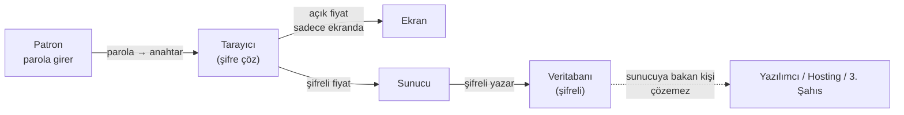

# Uzhan ERP — Servis Filosu Yönetim Sistemi

> **Servis filonuzu yönetin, fiyatlarınızı kimseye göstermeden.**

*Son güncelleme: Mayıs 2026*

---

## İçindekiler

1. [Karşı Karşıya Olduğunuz Sorunlar](#1-karşı-karşıya-olduğunuz-sorunlar)
2. [Çözüm: Uzhan ERP](#2-çözüm-uzhan-erp)
3. [Modüller ve Özellikler](#3-modüller-ve-özellikler)
4. [Gizlilik Mimarisi — En Önemli Konu](#4-gizlilik-mimarisi--en-önemli-konu)
5. [Rol Bazlı Erişim — Kim Neyi Görür](#5-rol-bazlı-erişim--kim-neyi-görür)
6. [Mobil ve Web Uyumu](#6-mobil-ve-web-uyumu)
7. [Kurulum Süreci](#7-kurulum-süreci)
8. [Fiyat Paketleri](#8-fiyat-paketleri)
9. [Sıkça Sorulan Sorular](#9-sıkça-sorulan-sorular)
10. [Sonraki Adım](#10-sonraki-adım)

---

## 1. Karşı Karşıya Olduğunuz Sorunlar

Servis ve lojistik işi yapan firmalar, çoğunlukla aynı zorluklarla boğuşuyor:

- **Excel kâbusu.** Aylık puantaj, fiyat değişiklikleri, ek işler — hepsi onlarca dosyada dağınık. Bir hücre yanlış girilince ay sonu rakam tutmuyor.
- **Fiyat sızıntısı.** Bilgisayardaki Excel dosyası, e-posta eki, WhatsApp'tan paylaşılan tablo… Fiyatlarınız kontrolünüzden çıkıyor. Bir gün rakibinizin elinde buluyorsunuz.
- **Evrak takibi karmaşası.** Ruhsat, sigorta, muayene, çalışma ruhsatı — hangi araç, hangi tarihte yenilenmesi gerekir? Süresi dolan bir belgeyi fark etmemek pahalıya patlıyor.
- **Ay sonu raporlaması saatlerce sürüyor.** Fabrikaya kesilecek faturayı, tedarikçiye yapılacak ödemeyi, KDV/tevkifat hesabını çıkarmak yarım gün alıyor.
- **Tedarikçi/şoför iletişimi dağınık.** Kim ne zaman ek iş yaptı, hangi şoför ne kadar gün çalıştı — net liste yok.

**Sonuç:** Vakit kaybı, hata, sızan fiyatlar, kaçırılan tarihler.

---

## 2. Çözüm: Uzhan ERP

Uzhan ERP, servis filosu olan firmaların **operasyonunu, evraklarını ve maliyetini tek yerden yönettiği**, web tarayıcısından çalışan bir yazılımdır.

- Bilgisayara, telefona, tablete kurulum gerekmez. **Tarayıcıdan açıp giriyorsunuz, hepsi bu.**
- **Tam yönetilen hizmet:** sunucusunu da kurulumunu da güncellemesini de yedek almasını da biz hallederiz. Sizde IT olmasına gerek yok.
- **En önemlisi:** fiyatlarınız sistemde **şifreli** durur. Anahtarı yalnızca siz bilirsiniz. Bizim ekibimiz bile sunucuya baksa fiyatlarınızı çözemez.

> Tek cümleyle: **Servis filonuzu yönetirken fiyatlarınızı paylaşmak zorunda değilsiniz.**

---

## 3. Modüller ve Özellikler

| Modül | Ne İşe Yarar |
|-------|--------------|
| **Tedarikçi Yönetimi** | Vergi numarası, iletişim, evrak — her tedarikçinin tek profili |
| **Şoför Yönetimi** | Ehliyet, SRC, psikoteknik, adli sicil takibi — tarihler dolmadan uyarı |
| **Araç Yönetimi** | Plaka, marka/model, kapasite + ruhsat, sigorta, muayene, koltuk sigortası, çalışma ruhsatı bitiş tarihleri |
| **Proje ve Güzergah** | Hangi araç, hangi projede, hangi güzergahta çalışıyor; her güzergaha ayrı fiyat |
| **Aylık Puantaj** | Günlük sefer girişi, otomatik ay sonu hesabı (KDV, tevkifat dahil) |
| **Ek İş / Mesai** | Olağan dışı işler, onay süreciyle, izlenebilir geçmişle |
| **Evrak Arşivi** | PDF olarak araç ve şoför evrakları, geçerlilik takibi, süre dolmadan uyarı |
| **Tedarikçi Portalı** | Tedarikçi giriş yapıp kendi araçlarını ve hesabını görür — işlerini hızlandırırsınız |
| **Raporlar** | Tedarikçi hak ediş raporu, fabrika faturalama raporu, PDF çıktı |
| **Bildirimler** | Belge süresi yaklaşan, onay bekleyen ek iş — sistemde otomatik bildirim |

---

## 4. Gizlilik Mimarisi — En Önemli Konu

Sizin için en kritik soru şu: **"Fiyatlarım gerçekten kimseye sızmaz mı?"**

Cevabımız üç katmanlı:

### Katman 1 — Sizin Sunucunuz, Sizin Veritabanınız

Her müşteri için **ayrı sunucu, ayrı veritabanı** kurarız. Diğer müşterilerin verisi ile sizinki birbirine karışmaz, kimse yanlışlıkla bir başkasının verisini göremez.

### Katman 2 — Fiyat Alanları Şifreli Tutulur

- **Birim fiyat, fabrika fiyatı, ek iş tutarı, puantaj fiyat görüntüsü** gibi tüm hassas alanlar veritabanına **şifreli** yazılır.
- Şifreleme anahtarı, **size özel bir parola**dan üretilir. Bu parola sunucuda hiçbir yerde saklanmaz.
- Sisteme giriş yaptığınızda parolanız tarayıcıda anahtara dönüşür ve fiyatlar geçici olarak çözülür. Çıkış yaptığınız anda anahtar siliniyor.
- **Sonuç:** Bizim ekibimiz, hosting sağlayıcısı, hatta veritabanına kötü niyetle erişen biri sunucuya baksa **rakamları göremez**, sadece anlamsız şifre kümesi görür.

### Katman 3 — Sözleşmesel Garanti

- Hizmet sözleşmesinde **gizlilik (NDA) maddesi** standart olarak bulunur.
- İstediğiniz an verinizi **şifreli yedek olarak** size teslim ederiz.
- Sözleşmeyi sonlandırırsanız 7 iş günü içinde sunucu temizlenir, yazılı tutanak verilir.

> **Pratik olarak ne demek?** Çalışanınız da, biz de, hosting sağlayıcısı da fiyatlarınızı *bilemeyiz*. Sadece patron ekranında, sadece patron giriş yaptığında, sadece patronun kafasındaki parola ile fiyatlar çözülür.

---

## 5. Rol Bazlı Erişim — Kim Neyi Görür

Sistemdeki dört farklı kullanıcı tipi vardır. Her birinin ne göreceği önceden tanımlıdır.

| Rol | Tedarikçi | Şoför | Araç | Puantaj | **Fiyatlar** | Raporlar | Kullanıcı Yönetimi |
|-----|-----------|-------|------|---------|--------------|----------|---------------------|
| **Patron / Yönetici (Admin)** | Görür ve düzenler | Görür ve düzenler | Görür ve düzenler | Görür ve düzenler | **Tam erişim** | Tam | Var |
| **Operatör (User)** | Görür | Görür | Görür | Girer | **Görmez** | Sınırlı | Yok |
| **Tedarikçi** | Sadece kendisi | Kendi araçlarındakiler | Kendi araçları | Kendi araçlarınınki | Sadece **kendi hak edişi** | Kendi raporları | Yok |
| **Müşteri Müdürü (Manager)** | Görür | Görür | Görür | Görür ve onaylar | Görür, düzenleyemez | Tam | Yok |

**Pratik örnek:** İşe yeni başlayan operatörü "Operatör" olarak ekleyin. Puantajı, evrakları görür, günlük girişi yapar — ama hiçbir fiyatı görmez. Patronsanız, tek başınıza gerçek rakamları gören kişisiniz.

---

## 6. Mobil ve Web Uyumu

- **Bilgisayar (Windows / Mac):** Chrome, Edge, Safari ile sorunsuz
- **Tablet:** Tarayıcıdan tam ekran çalışır
- **Telefon:** Mobil uyumlu arayüz, sahada puantaj girilebilir
- **Kurulum yok:** Hiçbir cihaza yazılım kurulmaz, sadece tarayıcı kullanılır

> Ekran görüntüleri için demo talebinde bulunabilirsiniz.

---

## 7. Kurulum Süreci

Üç adımda işiniz biter:

### Adım 1 — Sözleşme ve Hazırlık (1–2 gün)

- Sözleşme imzalanır, kurulum bedeli tahsil edilir
- Tercih ettiğiniz alan adı (`firmaadi.com.tr`, `firmaadi.com` vb.) belirlenir
- Kullanıcı listesi alınır (kim hangi rolde olacak)

### Adım 2 — Kurulum (1 iş günü)

- Sunucu kurulur, alan adı bağlanır, SSL sertifikası alınır
- **Şifreleme anahtarınızı sizinle birlikte oluştururuz** — anahtar bizde tutulmaz, sadece size verilen kurtarma kodu ile geri alınır
- Mevcut Excel verileriniz varsa içe aktarılır
- Demo verileriyle test çalıştırılır

### Adım 3 — Eğitim ve Devir (1 saat online)

- Patron + bir operatör için online (ekran paylaşımıyla) eğitim
- Sıkça yapılan işlemler (puantaj girme, evrak yükleme, rapor alma) gösterilir
- Eğitim videosu kayıt altında size verilir

**Toplam süreç:** Sözleşme imzalandıktan sonra **3 iş günü içinde sistem hazır.**

---

## 8. Fiyat Paketleri

Üç paketimiz var. Müşteri başına ayrı sunucu kurulduğu için fiyatlandırmamız da işletme büyüklüğüne göredir.

| | **Başlangıç** | **Standart** | **Premium** |
|--|---------------|--------------|-------------|
| **Hedef** | 0–15 araç | 15–40 araç | 40+ araç |
| **Kurulum (tek sefer)** | **15.000 TL** | **22.000 TL** | **30.000 TL** |
| **Aylık Hizmet** | **1.000 TL/ay** | **1.500 TL/ay** | **2.250 TL/ay** |
| Sunucu + alan adı + SSL | Dahil | Dahil | Dahil |
| Otomatik günlük yedek | Dahil | Dahil | Dahil |
| Aylık güncellemeler | Dahil | Dahil | Dahil |
| **Fiyat şifrelemesi (Katman 2)** | Dahil | Dahil | Dahil |
| Destek kanalı | E-posta + WhatsApp | E-posta + WhatsApp + Telefon | Tümü + öncelikli yanıt |
| Yanıt süresi (mesai içi) | 1 iş günü | 4 saat | 1 saat |
| Eğitim seansı | 1 saat (online) | 2 saat (online) | 4 saat (online) + tazeleme |
| Rapor özelleştirme | Standart | 1 özel rapor dahil | 3 özel rapor dahil |
| Modül özelleştirme | Saatlik ücretle | %15 indirimli | %25 indirimli |
| **Sözleşmesel gizlilik (NDA)** | Standart | Standart | Genişletilmiş |

### Aylık Hizmete Dahil Olanlar

- Sunucu kira bedeli (Hetzner / DigitalOcean)
- Alan adı yıllık ücreti (`.com.tr`, `.com`, `.com.tr` ortalama)
- Let's Encrypt SSL sertifikası (ücretsiz, biz yönetiyoruz)
- Günlük otomatik yedek (30 gün geriye dönük)
- Aylık güvenlik güncellemeleri
- WhatsApp / e-posta üzerinden destek (mesai içi, makul süre)
- Küçük hata düzeltmeleri (yarım iş günü altı işler)
- Fiyat şifreleme altyapısı

### Aylık Hizmete Dahil Olmayanlar

- Yeni modül geliştirme (örn. yeni bir rapor, yeni bir entegrasyon) — **saatlik veya proje bazlı**
- KDV (fiyatlar KDV hariçtir)
- Çok büyük veri içe aktarımı (1.000+ satır Excel) — bir defalık ücret

### İptal Koşulları

- **Minimum süre yok.** İstediğiniz an sözleşmeyi sonlandırabilirsiniz.
- **30 gün önceden** yazılı bildirim yeterlidir.
- Sözleşme bittiğinde **şifreli yedeğiniz size teslim edilir**, sunucu silinir, tutanak imzalanır.

---

## 9. Sıkça Sorulan Sorular

### "Fiyatlarımı gerçekten kimse göremez mi? Siz bile mi?"

Evet, biz bile göremeyiz. Şu şekilde işliyor:

1. Sisteme ilk girişinizde size özel bir **parola** belirlersiniz.
2. Bu parola tarayıcınızda **şifreleme anahtarına** dönüşür ve sunucuya **gönderilmez**.
3. Fiyat girdiğinizde tarayıcınız önce şifreler, sonra sunucuya yollar.
4. Sunucuya bakan biri (biz, hosting sağlayıcı, kötü niyetli biri) sadece şifreli rakamı görür — örneğin `f4a8c9...` gibi anlamsız bir karakter dizisi.
5. Çözmek için sizin kafanızdaki parola gerekir, başka yolu yoktur.

### "Anahtarı / parolayı unutursam ne olur?"

Kurulum sırasında size bir **kurtarma kodu** veriyoruz (8 kelimeden oluşan bir cümle gibi). Bunu kasada, banka kasasında veya emanette saklamanızı öneriyoruz. Parola unutulursa kurtarma kodu ile yeniden anahtar oluşturulur.

**Önemli:** Hem parolayı hem kurtarma kodunu kaybederseniz fiyat verileriniz **geri getirilemez**. Bu, gizliliğin doğal bedelidir — biz bile çözemediğimiz için size de geri veremeyiz. Diğer veriler (araç, şoför, evrak) bu durumda da elinizdedir.

### "Verim sizin sunucuda mı duruyor? Bana güvenmem mi gerekiyor?"

Veriniz bizim yönettiğimiz sunucuda durur, ama:

- **Fiyatlar şifreli** — biz çözemeyiz.
- **İstediğiniz an kopyasını alabilirsiniz** — şifreli yedek olarak gönderiyoruz, kendi yedek kopyanız oluyor.
- **Sözleşme sonlandığında veri sunucudan silinir**, yazılı tutanak imzalanır.
- İsterseniz Premium paketinde verinizin **kendi şirketinizin sunucusuna** taşınması seçeneği vardır (ek ücretle).

### "İnternet kesilirse sistem çalışmaz, ne yapacağız?"

- **Otomatik günlük yedek** alındığı için en kötü senaryoda dünkü veriye erişebilirsiniz.
- **Excel / PDF dışa aktarımı** vardır — kritik raporu dışa aktarıp telefonda saklayabilirsiniz.
- Sunucu kesintisi olursa (yılda %1'den az) telefonla bilgilendirir, hızlıca yeniden ayağa kaldırırız.

### "Sözleşme uzun süre bağlar mı?"

Hayır. Minimum süre yok, **30 gün önceden bildirim** ile her ay iptal edebilirsiniz. Memnun değilseniz takılıp kalmazsınız.

### "Birden fazla şube / firma için kullanabilir miyim?"

Evet. Her şubeyi ayrı bir "organizasyon" olarak ekleyebiliriz. Tek kullanıcı birden fazla şubeyi yönetebilir, raporlar şube bazlı çıkar.

### "Mobil uygulama var mı?"

Ayrı bir mobil uygulama yok ama sistem **mobil uyumlu**. Sahadaki şoför veya operatör telefondan girip puantaj geçebilir, evrak fotoğrafı yükleyebilir. Bu, cihaza uygulama kurulmadığı için **otomatik güncel** olur, **App Store / Play Store** sıkıntısı yok.

### "Vergi mevzuatı veya KDV oranı değişirse?"

KDV oranı, tevkifat oranı gibi değerler **ayarlardan** kolayca değiştirilir. Mevzuat değişirse sizden talep gelmesini beklemeden bilgilendirir, gerekirse güncelleme uygularız.

### "Eğitimi alacak kişi 60 yaşındaki muhasebecim, kullanabilir mi?"

Evet. Sistem Excel'den daha kolay olacak şekilde tasarlandı. Eğitim sonrası **kayıtlı video** veriyoruz, gerektiğinde tekrar izleyebilir. WhatsApp üzerinden ekran görüntüsüyle soru sorabilir, yanıt alır.

---

## 10. Sonraki Adım

İlgilendiyseniz iki seçeneğiniz var:

### A) Demo Talep Edin

Size **online ekran paylaşımıyla** 30 dakikalık canlı demo gösteririz. Kendi araç plakalarınızla, kendi tedarikçi adlarınızla doldurup nasıl çalıştığını görürsünüz. **Hiçbir taahhüt yok.**

### B) Doğrudan Kurulum Konuşalım

Kararınızı verdiyseniz, paketi seçip sözleşme aşamasına geçeriz. **3 iş günü içinde** sisteminiz çalışıyor olur.

---

### İletişim

- **WhatsApp:** *(numara doldurulacak)*
- **E-posta:** *(adres doldurulacak)*
- **Web:** *(adres doldurulacak)*

---

> *Bu doküman bilgilendirme amaçlıdır. Fiyatlar KDV hariçtir ve piyasa şartlarına göre güncellenebilir. Nihai teklif, ihtiyaç görüşmesi sonrasında yazılı olarak iletilir.*
