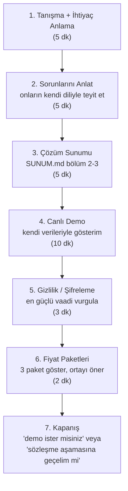
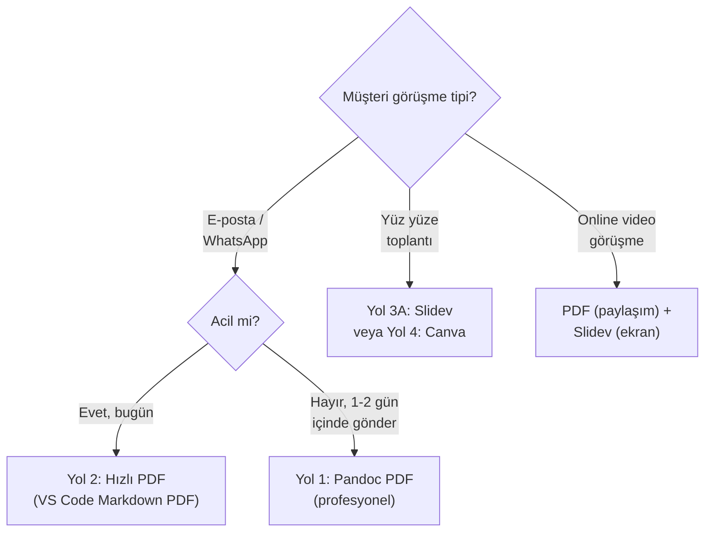

# Sunumu Müşteriye Nasıl İletirim?

> [SUNUM.md](SUNUM.md) elinde. Şimdi bunu **müşteriye gösterilebilir** profesyonel bir formata çevirip sunma kılavuzu.

*Son güncelleme: Mayıs 2026*

---

## TL;DR — En Hızlı Yol

**5 dakikada profesyonel PDF:** [Pandoc + Eisvogel template](#yol-1--pdf-pandoc--eisvogel-en-profesyonel-görünüm).
Sonuç: 12-15 sayfa, kurumsal görünümlü PDF. WhatsApp'tan, e-postadan rahatça gönderebilirsin.

**1 günde profesyonel sunum sitesi:** [GitHub Pages + Slidev](#yol-3--web-sitesi-veya-slayt).
Sonuç: `firmaadi.com/sunum` linki paylaşıyorsun, müşteri tarayıcıdan açıp inceliyor.

---

## İçindekiler

1. [Müşteri Tipine Göre Format Seçimi](#1-müşteri-tipine-göre-format-seçimi)
2. [Yol 1 — PDF (Pandoc + Eisvogel, En Profesyonel Görünüm)](#yol-1--pdf-pandoc--eisvogel-en-profesyonel-görünüm)
3. [Yol 2 — PDF (Hızlı, Tarayıcı ile)](#yol-2--pdf-hızlı-tarayıcı-ile)
4. [Yol 3 — Web Sitesi veya Slayt](#yol-3--web-sitesi-veya-slayt)
5. [Yol 4 — Canva ile Görsel Slayt](#yol-4--canva-ile-görsel-slayt)
6. [Sunum Akışı — 30 Dakikalık Görüşme](#5-sunum-akışı--30-dakikalık-görüşme)
7. [İletişim Şablonları](#6-i̇letişim-şablonları)
8. [Karar Ağacı](#7-karar-ağacı)

---

## 1. Müşteri Tipine Göre Format Seçimi

| Müşteri Profili | Önerilen Format | Neden |
|-----------------|-----------------|-------|
| **WhatsApp'tan iletişim, küçük firma (5–15 araç)** | PDF (10–12 sayfa) | Hızlı bakar, telefonda açar |
| **E-posta talebi, orta firma (15–40 araç)** | PDF + 30 dk online demo | Karar verici raporu inceler |
| **Kurumsal görüşme, müdür/müdire ile yüz yüze** | Slayt sunumu (PowerPoint/Slidev) | Ekrana yansıt, tartışarak ilerle |
| **Özel teklif istenen büyük firma** | PDF + özel tasarlanmış teklif mektubu | Profesyonellik kritik |

---

## Yol 1 — PDF (Pandoc + Eisvogel, En Profesyonel Görünüm)

**Sonuç:** Kurumsal görünümlü, 12–15 sayfalık PDF. Kapak, içindekiler, başlıklı/numaralı bölümler, tablolar, mermaid diyagramları görsel olarak işlenmiş.

### Ön Hazırlık (Tek Sefer, ~15 dakika)

**1. Pandoc Kur**

Windows'ta PowerShell'de:

```powershell
winget install --id JohnMacFarlane.Pandoc
```

Veya [pandoc.org/installing](https://pandoc.org/installing.html) sayfasından `.msi` indirip kurun.

**2. MiKTeX Kur (LaTeX motoru)**

Pandoc'un PDF üretmesi için LaTeX gerekli. Windows'ta:

```powershell
winget install --id MiKTeX.MiKTeX
```

İlk çalıştırmada eksik LaTeX paketlerini otomatik indirir, "Always install" seç.

**3. Eisvogel Şablonunu İndir**

[Eisvogel GitHub](https://github.com/Wandmalfarbe/pandoc-latex-template) sayfasından son sürümün `.zip`'ini indir, içinden `eisvogel.latex` dosyasını çıkar.

Windows'ta şu klasöre koy:

```
C:\Users\<KULLANICI>\AppData\Roaming\pandoc\templates\eisvogel.latex
```

(Klasör yoksa oluştur.)

**4. Mermaid Filtresi (Opsiyonel — diyagramlar için)**

```powershell
npm install -g mermaid-filter
```

Bu, MD'deki mermaid diyagramlarını PDF'de görsel olarak render eder.

### PDF Üretme

Proje kökünde PowerShell aç:

```powershell
pandoc SUNUM.md `
  -o SUNUM.pdf `
  --from markdown `
  --template eisvogel `
  --filter mermaid-filter `
  --pdf-engine=xelatex `
  --variable mainfont="Calibri" `
  --variable monofont="Consolas" `
  --variable geometry:margin=2cm `
  --variable titlepage=true `
  --variable titlepage-color="1F4788" `
  --variable titlepage-text-color="FFFFFF" `
  --toc `
  --toc-depth=2 `
  --listings
```

İlk çalıştırmada MiKTeX eksik paketleri indirecek, 2–5 dakika sürer. Sonraki seferler 10 saniye.

### Kapak Sayfası Eklemek (Daha Profesyonel)

[SUNUM.md](SUNUM.md) dosyasının başına şu YAML metadata bloğunu ekle:

```yaml
---
title: "Uzhan ERP"
subtitle: "Servis Filo Yönetim Sistemi"
author: "[ŞİRKET ADI]"
date: "Mayıs 2026"
titlepage: true
titlepage-color: "1F4788"
titlepage-text-color: "FFFFFF"
titlepage-rule-color: "FFFFFF"
toc: true
toc-own-page: true
header-left: "Uzhan ERP"
footer-left: "[ŞİRKET ADI] - Gizli ve Kişiye Özel"
lang: tr
---
```

Sonuç: lacivert kapak, beyaz yazılar, 2. sayfa içindekiler, sonra içerik.

### Avantaj/Dezavantaj

| Artı | Eksi |
|------|------|
| Kurumsal görünüm | İlk kurulum 15 dakika sürer |
| Tek komutla 10 saniyede yeniden üretilir | LaTeX'i tanımıyorsan ürkütücü gelebilir |
| MD güncellendiğinde yeniden bas | — |
| Ücretsiz | — |

---

## Yol 2 — PDF (Hızlı, Tarayıcı ile)

**Sonuç:** Hızlı çözüm ama görünüm Yol 1'den biraz zayıf.

### Adımlar

**1. Markdown'u HTML'e çevir**

[markdownpdf.com](https://md2pdf.netlify.app) veya [dillinger.io](https://dillinger.io) gibi online dönüştürücülere SUNUM.md'yi yapıştır → "Export as PDF" tıkla.

**2. VS Code Extension ile (Tercih edilen yerel çözüm)**

VS Code'da şu eklentilerden birini kur:

- **Markdown PDF** (yzane) — Sağ tıkla → "Markdown PDF: Export (pdf)"
- **Markdown Preview Enhanced** — Sağ panelde "Open in Browser" → tarayıcıdan PDF olarak yazdır

Bu eklenti otomatik içindekiler ve düzgün stilleme sağlar.

### Avantaj/Dezavantaj

| Artı | Eksi |
|------|------|
| 1 dakikada hazır | Görünüm "Word'den çıkmış" tarzı |
| Pandoc gerekmez | Mermaid render edilmeyebilir |
| — | Kapak sayfası yok |

---

## Yol 3 — Web Sitesi veya Slayt

### Seçenek A: Slidev (Slayt Sunum)

Eğer **müşteriyle ekran karşısında** sunum yapacaksan, MD'yi slayta çevirmek için:

**Kurulum:**

```powershell
npm install -g @slidev/cli
```

**Çalıştırma:**

[SUNUM.md](SUNUM.md) dosyasını biraz uyarlaman gerekecek (her başlık → ayrı slayt, `---` ile bölünmüş). Sonra:

```powershell
slidev SUNUM.md
```

Tarayıcıda `localhost:3030` açılır, profesyonel slaytlar gelir. PDF'e veya pptx'e export edebilirsin:

```powershell
slidev export SUNUM.md
```

### Seçenek B: GitHub Pages (Web Sayfası)

Müşteriye link gönderip "tarayıcıdan aç" demek istiyorsan:

1. Yeni GitHub repo aç: `firmaadi-sunum` (Public veya Private)
2. SUNUM.md'yi `index.md` olarak yükle
3. Settings → Pages → Source: `main` branch, `/ (root)`
4. Tema seç (Cayman, Slate, Architect tarzı kurumsal duranlar)
5. URL alırsın: `username.github.io/firmaadi-sunum`
6. Müşteriye linki gönder

**Custom domain** için: `sunum.firmaadi.com.tr` benzeri subdomain bağlayabilirsin (DNS CNAME).

### Seçenek C: Notion / GitBook

- **Notion:** SUNUM.md'yi Notion'a yapıştır, "Share to web" → link al → müşteriye yolla
- **GitBook:** Daha "kitap" tarzı görünüm, ücretsiz hesap yeterli

### Avantaj/Dezavantaj

| Artı | Eksi |
|------|------|
| Müşteri istediği yerden açar | Müşteri linki başkasına yollayabilir |
| Güncellersen anında günceldir | Offline çalışmaz |
| Profesyonel | İnternet kesilirse sunum yok |

---

## Yol 4 — Canva ile Görsel Slayt

**Sonuç:** En göz alıcı sunum ama içerik MD'den manuel taşımak gerekir.

### Adımlar

1. [canva.com](https://canva.com) → ücretsiz hesap
2. "Sunum" şablonlarından "Pitch Deck" veya "Business Presentation" ara
3. Sektörel temalardan birini seç (mavi/lacivert kurumsal duranlar)
4. SUNUM.md içeriğini bölümlere göre slaytlara dağıt (15–20 slayt)
5. Görseller, ikonlar Canva kütüphanesinden ücretsiz
6. Export: PDF veya PPTX

### Tavsiye Edilen Slayt Yapısı (16 Slayt)

| Slayt | İçerik |
|-------|--------|
| 1 | Kapak — "Uzhan ERP — Servis Filo Yönetim Sistemi" |
| 2 | Sorun — Excel kâbusu (3 madde) |
| 3 | Sorun — Fiyat sızıntısı |
| 4 | Çözüm — "Tek cümleyle ne yapıyoruz" |
| 5 | Modüller — 10'lu liste, ikonlu |
| 6 | Gizlilik — 3 katman özet |
| 7 | Gizlilik — Mermaid akış görseli |
| 8 | Roller matrisi — Kim ne görür |
| 9 | Mobil/Web uyumu — ekran görüntüleri |
| 10 | Kurulum süreci — 3 adım |
| 11 | Fiyat paketi — Başlangıç |
| 12 | Fiyat paketi — Standart |
| 13 | Fiyat paketi — Premium |
| 14 | SSS — En kritik 3 soru-cevap |
| 15 | Sonraki Adım — Demo iste / İletişim |
| 16 | Teşekkür ve İletişim Bilgileri |

### Avantaj/Dezavantaj

| Artı | Eksi |
|------|------|
| Görsel olarak en güzel duran | İçerik manuel taşınır (~2 saat iş) |
| Müşteriyi etkiler | MD güncellersen Canva'yı da elle güncellersin |
| PowerPoint formatında verir | Ücretsiz planda bazı şablonlar kilitli |

---

## 5. Sunum Akışı — 30 Dakikalık Görüşme

PDF/slayt elindeyse müşteri görüşmesinin akışı şöyle olmalı:



### Demo İpuçları

- **Hazır demo verisi tutmak** çok önemli (gerçekçi araç plakaları, tedarikçi adları)
- Müşterinin **kendi firma adını ve 1 araç plakasını** önceden sisteme girip "bakın sizin verileriniz olsa böyle görünür" demek müthiş etkili
- Gizlilik vaadini **DB ekranından** göster: "Bakın bu fiyat alanı veritabanında şöyle şifreli görünüyor"

---

## 6. İletişim Şablonları

### A) WhatsApp / E-posta — İlk Tanışma

```
Merhaba [İSİM] Bey/Hanım,

[Tanıştığımız yer / referans] üzerinden ulaşıyorum. Servis filolarınızın
puantaj, evrak ve maliyet takibini kolaylaştıran bir yazılım üzerinde
çalışıyorum: Uzhan ERP.

Excel ile takip eden firmalara fiyatlarını sızdırmadan, evrak süreleri
kaçmadan, ay sonu raporlama saatlerce sürmeden filo yönetimi sağlıyor.

Müsait olduğunuz bir gün **15 dakikalık tanışma görüşmesi** yapabilir miyiz?
Ekran paylaşımıyla 5 dakikalık demo gösterip, ihtiyacınıza uyup uymadığını
birlikte değerlendiririz.

Saygılarımla,
[ADIN]
[ŞİRKET]
[TELEFON]
```

### B) Görüşme Sonrası — Sunum Gönderimi

```
Merhaba [İSİM] Bey/Hanım,

Bugünkü görüşmemiz için teşekkür ederim. Konuştuğumuz konularla ilgili
detaylı sunumumu ekte bulabilirsiniz: [SUNUM.pdf]

Özetle:
✓ [Konuştuğunuz spesifik problem 1] için modülümüz var (Sayfa X)
✓ Fiyat gizliliği konusu — sayfa 4'te uçtan uca anlattım
✓ Sizin için uygun paket: [Standart] gibi görünüyor (Sayfa 11)

Kafanıza takılan bir konu olursa WhatsApp veya telefon ile aradığınızda
hemen yanıt veririm.

İlerleyebileceğimizi düşündüğünüz an demo görüşmesi planlayalım — 30
dakika ekran paylaşımıyla, sizin firma adınızla doldurulmuş demo
göstereceğim.

Saygılarımla,
[ADIN]
```

### C) Karar Aşamasında — Teklif Mektubu

```
Sayın [İSİM] Bey/Hanım,

Görüşmelerimiz neticesinde aşağıdaki paketi sizin için en uygun olarak
değerlendirdik:

PAKET: STANDART
═══════════════════════════════════════
Hedef: 15-40 araç
Kurulum (tek sefer): 22.000 TL + KDV
Aylık Hizmet: 1.500 TL + KDV
═══════════════════════════════════════

KAPSAM:
- Sunucu, alan adı, SSL — dahil
- Otomatik günlük yedek (30 gün geriye) — dahil
- Aylık güvenlik güncellemeleri — dahil
- Fiyat şifreleme altyapısı — dahil
- E-posta + WhatsApp + Telefon destek (4 saat içinde yanıt)
- 2 saatlik online eğitim
- 1 özel rapor

GEÇERLİLİK: Bu teklif [TARİH]'e kadar geçerlidir.

İLERLEYIŞ:
1. Sözleşme metnimi gönderiyorum (DPA + NDA dahil paket)
2. İmza sonrası %50 ön ödeme + %50 teslim sonrası
3. İmza tarihinden 3 iş günü içinde sisteminiz çalışıyor

İmzaya hazır olduğunuzda bana bildirin, sözleşme paketini gönderelim.

Saygılarımla,
[ADIN]
```

---

## 7. Karar Ağacı

Hangi yolu seçeceğine karar veremiyor musun?



### Kısa Tavsiye (Senin Durumun)

İlk müşteri için **Yol 1 (Pandoc)** — bir kez kurarsın, her güncellemede 10 saniyede yeniden basarsın. Sonradan büyük müşteri gelirse **Yol 4 (Canva)** ile özel görsel slayt yapabilirsin.

---

## 8. Kontrol Listesi — Müşteriye Gitmeden Önce

Sunum dosyasını hazırlamadan önce SUNUM.md içinde şunları doldurmuş olduğundan emin ol:

- [ ] Kapaktaki şirket adı (henüz `[ŞİRKET ADI]` ise)
- [ ] İletişim bilgileri (en sondaki bölüm)
- [ ] Logo (varsa kapak alanına)
- [ ] Müşteriye özel notlar (eğer kişiselleştirilmiş sunum yapacaksan)

**Sunumu sunmadan önce:**

- [ ] Demo hesabını hazır tut (`demo@uzhanerp.com` gibi)
- [ ] Demo verisinde gerçekçi tedarikçi adları var
- [ ] Müşterinin firma adını demoya önceden ekle (kişiselleştir)
- [ ] Kendi telefonunda sunum açılıyor mu test et (link veya PDF)
- [ ] Sözleşme paketi yanında olsun ("imza vermek isterse" durumu)

---

## EK — Hızlı Başlangıç Komutları

İlk PDF için tek komutluk paket (kopyala-yapıştır):

```powershell
# 1. Pandoc + MiKTeX kur
winget install --id JohnMacFarlane.Pandoc
winget install --id MiKTeX.MiKTeX

# 2. Eisvogel template indir (manuel)
# https://github.com/Wandmalfarbe/pandoc-latex-template

# 3. PDF üret
cd "C:\Users\esat berat\Desktop\UzhanServisUygulaması"
pandoc SUNUM.md -o SUNUM.pdf --template eisvogel --pdf-engine=xelatex --toc --variable titlepage=true --variable titlepage-color="1F4788"
```

---

*Bu doküman bir teknik kılavuzdur, hukuki bağlayıcılığı yoktur. Avukat tavsiyesi yerine geçmez.*

*Son güncelleme: Mayıs 2026*
